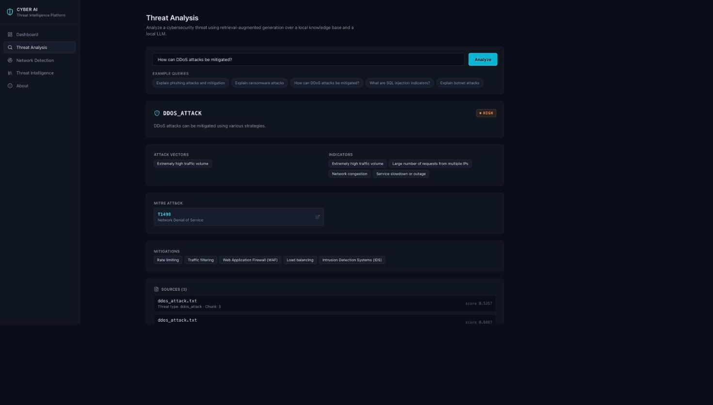
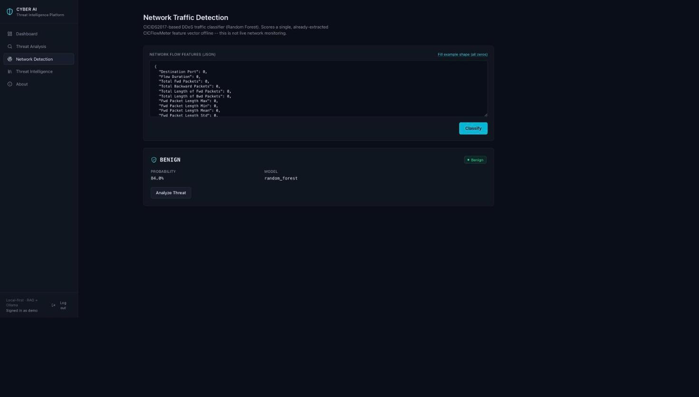
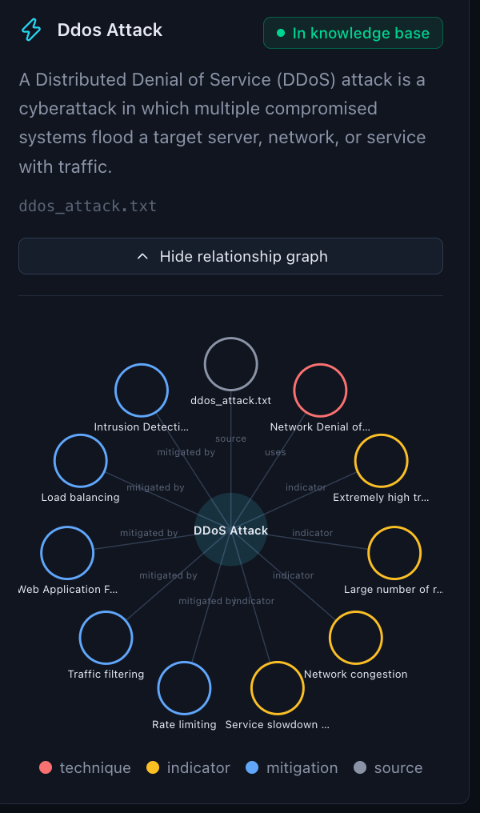
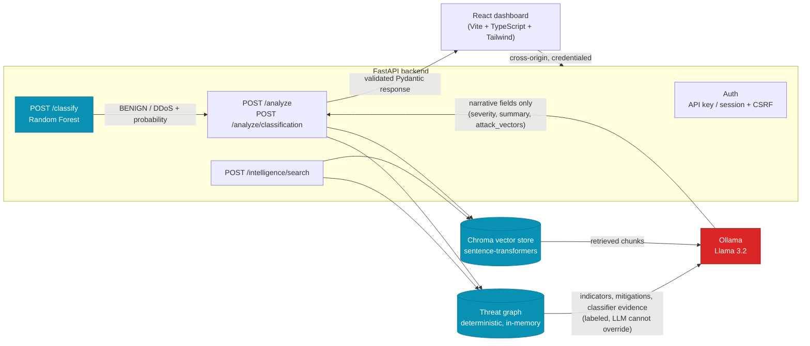
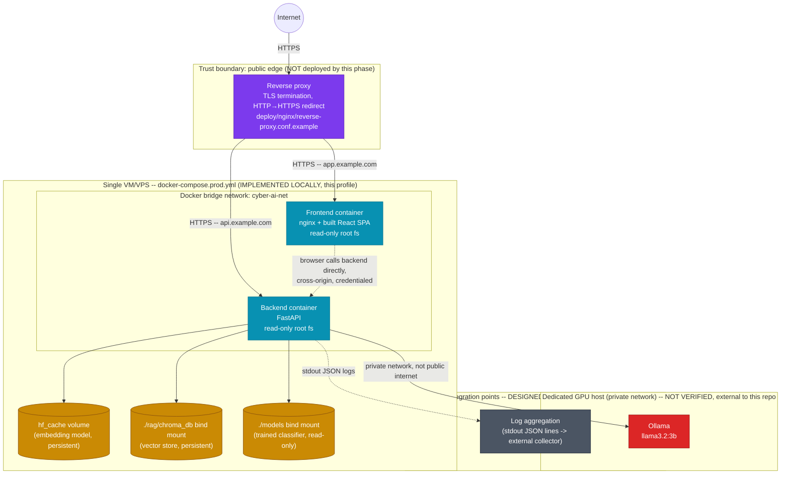

# Cyber AI Platform

[](https://github.com/abhisheknsalian/cyber-ai-platform/actions/workflows/ci.yml)

A local, retrieval-augmented cybersecurity threat-intelligence platform: a React dashboard backed by
a FastAPI service that combines a real, dataset-trained network-traffic classifier, a deterministic
threat-intelligence knowledge graph, vector retrieval over a small curated knowledge base, and a
locally-running LLM (via [Ollama](https://ollama.com)) — with the LLM structurally unable to
override any deterministic fact (classifier prediction, MITRE technique ID, source attribution) it's
given. A companion evaluation layer produces reproducible, methodology-transparent metrics for the
classifier, the retrieval paths, and the end-to-end pipeline. A documented (not deployed) production
architecture covers TLS, container hardening, scaling limits, and failure behavior. See the sections
below for exactly what's implemented, what's designed-only, and what remains unverified — this
README does not blur that line anywhere.

## Why This Project

**1. Evidence integrity.** Deterministic facts (classifier prediction, probability, MITRE ATT&CK
technique IDs, source attribution) are kept structurally separate from LLM-generated narrative — the
LLM's own output schema has no field for any of them, so it cannot override them even if prompted
to. This is verified with hostile-input tests that feed the LLM a deliberately fabricated response
and assert none of it reaches the API output (see **Threat Intelligence Graph** > "Evidence-first
LLM").

**2. Hybrid retrieval.** Threat analysis combines semantic vector retrieval (Chroma +
sentence-transformers) with a deterministic, in-memory threat-intelligence graph built by parsing
the same source documents — no LLM involved in graph construction. Graph-derived indicators and
mitigations reach the response directly, without depending on LLM generation (see **Threat
Intelligence Graph** > "Hybrid retrieval").

**3. Evaluation and engineering rigor.** A dedicated, read-only evaluation layer produces held-out
(not just full-dataset) classification metrics, threshold and calibration analysis, and a retrieval
sanity benchmark — all reproducible on demand and never presented as more than they are (see **Key
Results** below and **Evaluation & Benchmarking**). 285 automated backend tests cover this pipeline
end to end, including a real CI-only regression that was diagnosed, root-caused, and fixed (see
**Testing**).

## Key Results

The exact figures produced by `uv run python -m backend.evaluation` against the real local
CICIDS2017 dataset and trained model in this development environment — not rounded differently from
the full-precision values in **Evaluation & Benchmarking** below, which is the canonical source.

| Area | Result |
|---|---:|
| Held-out accuracy | 99.991% |
| Macro F1 | 99.991% |
| ROC-AUC | 0.99999985 |
| PR-AUC | 0.99999988 |
| Automated backend tests | 285 |
| Threat graph | 60 entities / 55 relationships |
| LLM analysis latency | ~2.6–2.7s |

**ML metrics are specific to the local CICIDS2017 Friday-afternoon binary BENIGN/DDoS dataset and
are not a general-purpose DDoS detection claim. Retrieval results (topic coverage 1.0, hybrid
evidence preservation 1.0 — see below) are from a six-query sanity benchmark, not a formal IR
benchmark.** See **Evaluation & Benchmarking** for the full results table, methodology, and every
caveat in detail.

## Key Capabilities

| Area | Capability |
|---|---|
| ML detection | Random Forest classifier trained on real CICIDS2017 network-flow data (BENIGN/DDoS); duplicate-removal leakage fix; multi-class-*ready* schema/metrics architecture (no additional class trained — see **ML Detection Pipeline**) |
| RAG | Chroma + sentence-transformers vector retrieval over a curated knowledge base, with a relevance threshold that keeps out-of-domain queries from ever reaching the LLM (see **Relevance Filtering**) |
| Threat intelligence graph | Deterministic, one-hop entity/relationship graph built from the same source documents — no LLM involved in graph construction (see **Threat Intelligence Graph**) |
| Hybrid retrieval | Combines vector and graph evidence into one typed, evidence-first LLM context (see **Threat Intelligence Graph** > "Hybrid retrieval") |
| Evidence integrity | The LLM's own output schema has no field for prediction/probability/MITRE ID/source — structurally, not just by prompt instruction, it cannot override them (see **Classifier integration**) |
| Authentication | API-key + browser session (HttpOnly cookie + CSRF double-submit), both fail closed (see **Authentication**) |
| Operational hardening | Rate limiting, request IDs, structured JSON logging, security headers, health/readiness separation (see **Observability & Operations**) |
| Evaluation | Reproducible held-out/full-dataset metrics, threshold and calibration analysis, retrieval coverage benchmark, per-stage pipeline latency (see **Evaluation & Benchmarking**) |
| Deployment architecture | Hardened Docker images, a production Compose profile, and a documented (not deployed) single-VM + reverse-proxy architecture (see **Production Deployment Architecture**) |

## Screenshots

Real captures from a local run against the real backend, real trained classifier, and real Ollama
model — not mockups.

**Threat Analysis** — a real `/analyze` query ("How can DDoS attacks be mitigated?"), showing the
deterministic MITRE ATT&CK technique, graph-derived mitigations, and source attribution alongside
the LLM-generated narrative:



**Network Detection** — the Random Forest classifier scoring a CICFlowMeter-style feature vector
(the all-zero example shape, not real captured traffic):



**Threat Intelligence graph** — the deterministic, one-hop relationship graph for one threat entity,
rendered as a radial node-link diagram (plain SVG, no charting library):



## Architecture



Deterministic components (blue) — the classifier, vector retrieval, and the graph — produce every
fact that ends up in a response. The LLM (red) contributes only narrative fields it has no schema
field to smuggle a fact into (see **Threat Intelligence Graph** > "Evidence-first LLM"). Out-of-domain
or unsupported queries never reach the LLM at all: if nothing in the knowledge base is actually
relevant, the API returns a `no_relevant_intelligence` result directly from the retrieval layer. See
**Relevance Filtering** below.

For the deployment-level view (containers, networks, trust boundaries, what's public vs. private),
see **Production Deployment Architecture** > "Architecture diagram" further down.

## Quick Start

One linear path to a running system. Every command below is the exact command already documented in
its own section further down (**Requirements**, **Running the Project**, **Ollama**, **Build the
Vector Database**, **Authentication**) — this just orders them into a single sequence.

```bash
# 1. Clone
git clone https://github.com/abhisheknsalian/cyber-ai-platform.git
cd cyber-ai-platform

# 2. Install dependencies
uv sync
cd frontend && npm install && cd ..

# 3. Configure environment (local values only -- never commit real secrets)
export CYBER_AI_USERNAME="choose-your-own-local-username"
export CYBER_AI_PASSWORD="choose-your-own-local-password"
export CYBER_AI_API_KEY="choose-your-own-local-value"      # only needed for direct API (non-browser) clients

# 4. Start Ollama (separate terminal, or already running as a service)
ollama serve
ollama pull llama3.2:3b

# 5. Build the vector database (from the tracked data/threat_intel/ documents)
uv run python -m backend.rag.ingestion

# 6. Start the backend
uv run uvicorn backend.main:app --reload

# 7. Start the frontend (separate terminal)
cd frontend && npm run dev

# 8. Open the browser
open http://localhost:5173
```

**What works immediately from a fresh clone:** the full RAG pipeline (Threat Analysis, Threat
Intelligence), login/session auth, and all 285 automated tests (`uv run pytest tests/ -v`) — none of
these need the trained classifier or the real dataset.

**9. Optional — the DDoS classifier.** `POST /classify` and the Network Detection page return `503`
until a model is trained, because **neither the trained model nor the real dataset is committed to
this repository** (both are gitignored, matching the pattern used for every other generated
artifact — see **Reproducibility**). Training requires the real CICIDS2017 CSV, which is gated
behind a registration form at cicresearch.ca, not a plain download — see **Getting the dataset**.
Once obtained and placed at `data/raw/Friday-WorkingHours-Afternoon-DDos.pcap_ISCX.csv`:

```bash
uv run python -m backend.ml.train
```

## Requirements

- Python 3.12+
- [uv](https://docs.astral.sh/uv/)
- Node.js 20+ and npm (for the frontend)
- [Ollama](https://ollama.com), installed and running locally

## Running the Project

### Backend

```bash
uv sync
uv run python -m backend.rag.ingestion   # build the vector store (see below)
uv run python -m backend.ml.train         # optional: train the DDoS classifier (see below)
uv run uvicorn backend.main:app --reload
```

`uv sync` installs FastAPI, LangChain, ChromaDB, sentence-transformers, the Ollama client,
scikit-learn, joblib, pytest, and the existing notebook/ML dependencies into a local `.venv`.
The classifier training step is optional -- `/analyze`, `/health`, and `/threats` all work
without it; only `/classify` and `/analyze/classification` need a trained model.

### Frontend

```bash
cd frontend
npm install
cp .env.example .env   # only needed if the backend isn't on the default http://localhost:8000
npm run dev
```

Opens at `http://localhost:5173`. It talks to the backend at the URL in `VITE_API_URL` (see
**Frontend** below).

## Ollama

Ollama must be installed and running separately — it is not managed by this project.

```bash
# start the Ollama daemon (if not already running)
ollama serve

# pull the model used by the backend (only needs to be done once)
ollama pull llama3.2:3b
```

The model name defaults to `llama3.2:3b` and can be overridden with the `OLLAMA_MODEL`
environment variable.

## Build the Vector Database

The Chroma vector store is not committed to git — it must be built locally from the tracked
threat-intelligence documents in `data/threat_intel/`:

```bash
uv run python -m backend.rag.ingestion
```

This discovers every `.txt` file in `data/threat_intel/`, chunks it, embeds it, and writes a
fresh Chroma collection to `rag/chroma_db/` (also gitignored). Each run wipes and rebuilds the
collection from scratch, so it's safe to re-run any time the source documents change — it never
accumulates stale or duplicate chunks.

## Backend Endpoints

- `GET /` — basic liveness message (public)
- `GET /health` — process/application health (does not run LLM inference — see below) (public)
- `GET /ready` — readiness: whether RAG/classifier/LLM dependencies are actually available (Phase 8; see **Observability & Operations** > "Health vs Readiness") (public)
- `GET /threats` — threat categories discovered from `data/threat_intel/*.txt`, for the frontend (public)
- `POST /analyze` — structured, retrieval-grounded threat analysis (protected, rate-limited)
- `POST /classify` — DDoS/BENIGN network-traffic classification (Random Forest); see **ML Detection Pipeline** (protected, rate-limited)
- `GET /ml/feature-importance` — the trained model's own `feature_importances_`, ranked (protected, not rate-limited — see **Observability & Operations** > "Rate limiting")
- `POST /analyze/classification` — takes an already-computed classifier prediction and runs it through the same RAG pipeline as `/analyze` (protected, rate-limited); response now also includes `evidence` (Phase 9)
- `GET /intelligence/entities` — every entity in the threat graph, optionally filtered by type (Phase 9; see **Threat Intelligence Graph**) (public)
- `GET /intelligence/graph/{threat_id}` — one threat's direct graph relationships (Phase 9) (public)
- `POST /intelligence/search` — hybrid (vector + graph) search (Phase 9; protected, rate-limited)
- `GET /docs` — interactive Swagger UI (public)
- `POST /auth/login`, `POST /auth/logout`, `GET /auth/me` — see **Authentication** below (login is rate-limited; all three are public — session/API-key auth is what they exist to provide, not what protects them)

`GET /health` response (unchanged since Phase 6):

```json
{
  "status": "ok",
  "vector_store": { "available": true, "chunk_count": 14, "collection": "threat_intel" },
  "llm": { "model": "llama3.2:3b", "reachable": true, "model_pulled": true }
}
```

`llm.reachable`/`model_pulled` come from listing installed Ollama models (`ollama.list()`) — this
is a status check, not a generation call, so `/health` still never invokes the LLM. `GET /ready`
uses the same underlying checks (plus whether a trained classifier is present) but, unlike
`/health`, returns HTTP 503 when something required is actually down — see **Observability &
Operations** for the full distinction and why both exist.

## API Contract

**This is a breaking change from the earlier query-parameter version** — `/analyze` now takes a
JSON body and returns a structured, validated response instead of free-form text.

### Request

```http
POST /analyze
Content-Type: application/json

{
  "query": "Explain phishing attacks and mitigation"
}
```

`query` must be 1–2000 characters after trimming whitespace; a blank or whitespace-only query is
rejected with `422`.

### Response

```json
{
  "query": "Explain phishing attacks and mitigation",
  "status": "analyzed",
  "threat": "phishing",
  "severity": "High",
  "summary": "Phishing is a cyberattack technique where attackers impersonate trusted entities to steal sensitive information.",
  "attack_vectors": ["suspicious URLs", "urgent language", "fake domains", "spelling mistakes", "unexpected attachments"],
  "mitre_attack": [
    { "id": "T1566", "name": "Phishing" },
    { "id": "T1598", "name": "Phishing for Information" }
  ],
  "indicators": ["email spoofing", "fake login pages", "credential harvesting", "malicious links"],
  "mitigations": ["employee awareness training", "email filtering", "multi-factor authentication"],
  "sources": [
    { "source": "phishing.txt", "threat_type": "phishing", "chunk_index": 6, "score": 0.6737 }
  ]
}
```

| Field | Meaning |
|---|---|
| `status` | `"analyzed"` or `"no_relevant_intelligence"` — always check this first |
| `threat` | The identified threat type, derived from the top-matching document's metadata (not LLM-generated) |
| `severity` | An LLM-generated qualitative judgment (`Low`/`Medium`/`High`/`Critical`) — **not** sourced from the knowledge base, which contains no severity ratings |
| `summary`, `attack_vectors`, `indicators`, `mitigations` | Generated by the LLM, constrained to only use the retrieved context |
| `mitre_attack` | Parsed directly out of the matched source `.txt` file(s) via regex — the LLM never generates this field, so a technique can only appear if it's genuinely present in the knowledge base |
| `sources` | Every retrieved chunk that supported the answer, with its filename, threat type, chunk index, and relevance score |

For an out-of-domain query (e.g. "What is the capital of France?"), the LLM is never called:

```json
{
  "query": "What is the capital of France?",
  "status": "no_relevant_intelligence",
  "threat": null,
  "severity": null,
  "summary": "No relevant threat intelligence was found in the knowledge base for this query. This system only answers questions covered by its threat-intelligence documents (botnets, DDoS, phishing, ransomware, SQL injection).",
  "attack_vectors": [], "mitre_attack": [], "indicators": [], "mitigations": [], "sources": []
}
```

### Error Responses

| Status | Cause |
|---|---|
| `422` | Empty/blank query, or query over 2000 characters (Pydantic validation) |
| `503` | Vector store hasn't been built yet, or Ollama is unreachable |
| `502` | Ollama returned a response that didn't match the required JSON schema |
| `500` | Any other unexpected error (logged server-side; no stack trace is returned to the client) |

### Example curl calls

```bash
# A supported threat type
curl -X POST http://127.0.0.1:8000/analyze \
  -H "Content-Type: application/json" \
  -d '{"query": "How can DDoS attacks be mitigated?"}'

# Out-of-domain — returns status: "no_relevant_intelligence", not a fabricated report
curl -X POST http://127.0.0.1:8000/analyze \
  -H "Content-Type: application/json" \
  -d '{"query": "What is the capital of France?"}'
```

## Relevance Filtering

Chroma's default collection distance is squared-L2, so **lower scores mean more similar**. The
retrieval layer (`backend/rag/retrieval.py`) fetches the top `RAG_TOP_K` candidates and keeps
only those with `score <= RAG_SCORE_THRESHOLD`; if nothing survives, the query is treated as
`no_relevant_intelligence` before the LLM is ever called.

The default threshold (`1.5`) was chosen empirically, by running `similarity_search_with_score`
for on-topic and off-topic queries against the real knowledge base:

| Query type | Example | Best-match score |
|---|---|---|
| On-topic | "Explain phishing attacks and mitigation" | 0.67 |
| On-topic | "Explain ransomware attacks" | 0.36 |
| On-topic | "How can DDoS attacks be mitigated?" | 0.54 |
| Off-topic | "What is the capital of France?" | 1.77 |
| Off-topic | "How do I bake a chocolate cake?" | 1.77 |

On-topic chunks scored 0.36–1.33 across all five threat types (including secondary matches);
off-topic queries never scored below 1.77. `1.5` sits in that gap with margin on both sides.

This is a small (14-chunk) knowledge base, so this threshold is a reasonable starting point, not
a rigorously tuned production value — re-run the same empirical check if the knowledge base grows
significantly.

## Threat Identification & MITRE ATT&CK Handling

- **Threat type** is the `threat_type` metadata of the single best-scoring retrieved chunk — not
  something the LLM infers. If a query's top match is ambiguous between two threats, only the
  single best match is reported; there is no multi-threat response yet.
- **MITRE ATT&CK techniques** are extracted with a regex (`T\d{4}: <name>`) directly from the
  source `.txt` file(s) matching the identified threat — never generated by the LLM. The five
  current documents only contain one or two techniques each; **this is not a MITRE ATT&CK
  database** — techniques not present in these five files (including sub-techniques, tactics, or
  related groups/software) simply won't appear, no matter what's asked.

## ML Detection Pipeline

**The classifier is trained on CICIDS2017-style network traffic and currently detects DDoS vs
BENIGN traffic. It is not a general-purpose malware detector or a real-time network monitoring
system.** `POST /classify` scores one already-extracted CICFlowMeter feature vector offline —
there is no packet capture, no live traffic ingestion, and no fabricated "live" dashboard.

```text
CICIDS2017 CSV (Friday-Afternoon-DDoS capture)
   → preprocessing (backend/ml/preprocessing.py): strip columns, drop inf/NaN, drop duplicates
   → train/test split (stratified, random_state=42)
   → RandomForestClassifier(n_estimators=100, random_state=42)
   → saved to models/ddos_random_forest.joblib (gitignored)

At inference:
NetworkTrafficFeatures (validated Pydantic request)
   → backend/ml/predictor.py: load saved model, predict + predict_proba
   → ClassificationResult (prediction, probability, classification, class_probabilities, model_version)
   → optionally: backend/services/classification.py maps DDoS → the same RAG query used by
     the Threat Analysis page → ThreatAnalysis (identical shape to /analyze's response)
```

### Getting the dataset

The CICIDS2017 "Friday-Afternoon-DDoS" CSV (~225k rows, 79 columns) is **not committed to this
repo** and is not downloadable via a plain public URL — CIC now gates it behind a registration
form at cicresearch.ca (name/email/organization). Register there yourself, download
`Friday-WorkingHours-Afternoon-DDos.pcap_ISCX.csv`, and place it at:

```text
data/raw/Friday-WorkingHours-Afternoon-DDos.pcap_ISCX.csv
```

(or point `DDOS_DATASET_PATH` at wherever you saved it).

### Training

```bash
uv run python -m backend.ml.train
```

Prints class distribution, a full classification report (including DDoS-specific
precision/recall/F1), and the confusion matrix, then saves the model to
`models/ddos_random_forest.joblib` and a metrics/metadata JSON alongside it. `models/` is
gitignored — the artifact is never committed. Training and inference are fully separate: the
API only ever loads the saved `.joblib` file (`backend/ml/predictor.py`); it never fits a model.

### Data leakage audit and fix

The original notebook (`notebooks/01_data_exploration.ipynb`) reported 99.99% accuracy / 1.00
precision-recall-F1 across the board. That result should not be trusted at face value. Auditing
the notebook's code found:

- No leakage from preprocessing-before-split in the classic sense (no scaler or encoder was fit
  on the full dataset before splitting).
- **No `drop_duplicates()` call anywhere before `train_test_split`.** CICIDS2017 -- and this
  specific Friday-Afternoon-DDoS capture -- is documented in ML-security literature (e.g.
  Engelen, Rimmer & Joosen, *"Troubleshooting an IDS Dataset: the CICIDS2017 Case Study"*, 2021)
  to contain large numbers of duplicate/near-duplicate flow records. Combined with a plain random
  80/20 split, duplicate rows can land in both train and test, letting the model "recognize" a
  test row it already memorized during training -- the textbook explanation for suspiciously
  perfect metrics on this exact dataset.
- `train_test_split` also didn't use `stratify=y` (minor; classes were already fairly balanced).

**Fix applied** in `backend/ml/preprocessing.py::load_and_clean_dataset`: deduplicate the full
cleaned dataset before the split (and log how many rows were removed), and stratify the split.
The model architecture and hyperparameters are unchanged (`RandomForestClassifier(n_estimators=100,
random_state=42)`), per Phase 4 scope -- only the leakage is fixed, not the model.

**Real metrics, from the real 225,745-row dataset, after the leakage fix above:**

| Metric | Value |
|---|---|
| Accuracy | 99.99% |
| Macro F1 | 99.99% |
| DDoS precision / recall | 99.996% / 99.988% |
| Train / test rows | 178,465 / 44,617 (stratified 80/20, post-cleaning) |
| Confusion matrix (BENIGN, DDoS) | `[[19013, 1], [3, 25600]]` |

Read this honestly, not as "DDoS is a solved problem": the leakage audit above ruled out
duplicate-row and label leakage (confirmed again in the Phase 10 audit below), and the top feature
importances are spread across legitimate flow-shape features rather than one dominant shortcut
(`Destination Port` ranks 10th at ~3.9%) — but this is still *one* attack tool against *one* target
in a *single, short capture window*. The classes are unusually separable by construction. This
result means "the model correctly learned to separate this specific DDoS tool's traffic pattern
from this specific benign traffic sample," not "any DDoS attack is trivially detectable in
general." Re-run `uv run python -m backend.ml.train` to reproduce these numbers yourself (see the
generated `models/ddos_random_forest.metadata.json` for the full classification report).

### Feature schema and validation

`backend/ml/config.py::FEATURE_COLUMNS` is the single source of truth for the 78 trained feature
names (in training order) -- both `backend/ml/schemas.py`'s Pydantic request model and
`frontend/src/types/ml.ts` are generated from (or kept in lockstep with) this same list, so the
request schema can never silently drift from what the model was actually trained on. Every field
is required, extra fields are rejected (`extra="forbid"`), and NaN/Infinity/non-numeric values
are rejected with a validation error -- untrusted traffic input is never passed straight to the
model.

### Explainability

`GET /ml/feature-importance` returns the trained model's own `feature_importances_`, ranked --
nothing is invented or hand-labeled.

### Multi-class-ready architecture (Phase 10)

**The trained model remains a genuine binary classifier: BENIGN or DDoS, nothing else.** The only
local training data is the one CICIDS2017 file above, which contains exactly these two labels (see
the Phase 10 dataset audit below) — no other attack class has been trained, and none is claimed.

What changed is the *architecture* around that model, so a real additional class can be added later
by editing configuration and retraining, not by hunting down scattered hardcoded values:

- **`backend/ml/config.py`'s `LABEL_MAP`** (`{"BENIGN": 0, "DDoS": 1}`, unchanged) is now the
  single source of truth every downstream component derives from, instead of each maintaining its
  own separate BENIGN/DDoS list.
- **`ClassificationResult.prediction` and `ClassificationAnalysisRequest.prediction`** are `str`,
  validated at runtime against `LABEL_MAP` (`backend/ml/schemas.py`) instead of a hardcoded
  `Literal["BENIGN", "DDoS"]`. This is not "accept any string" — a prediction outside the
  currently configured labels is still rejected (`422`), exactly as before; it's just checked
  against the one real source of truth instead of a second hardcoded copy of it.
- **`class_probabilities: dict[str, float] | None`** (additive) -- the complete `predict_proba()`
  vector keyed by class label (e.g. `{"BENIGN": 0.02, "DDoS": 0.98}`), not just the winning class's
  probability. Built in `backend/ml/predictor.py` from `model.classes_` (sklearn's own record of
  which label each `predict_proba()` column corresponds to) rather than assumed column positions,
  so it stays correct however many classes a future model has.
- **`model_version: str | None`** (additive) -- which trained artifact produced this prediction,
  sourced from `models/ddos_random_forest.metadata.json`'s own `trained_at` timestamp (the
  existing metadata format already has this field; no new "version" concept was invented). `None`
  if no metadata file is present alongside the model.
- **`backend/ml/train.py`'s metrics** (`compute_classification_metrics`) are now class-count-
  agnostic -- per-class precision/recall/F1, macro and weighted F1, and a confusion matrix sized
  and labeled from however many classes `LABEL_MAP` actually has, plus dataset-quality statistics
  (duplicate/missing/infinite-value counts, computed before cleaning) written into the training
  metadata. This already benefits the current binary model (see the real metrics table above); it
  isn't dormant multi-class code.
- **`backend/services/classification.py`'s `PREDICTION_TO_QUERY`/`PREDICTION_TO_THREAT_STEM`**
  mappings are unchanged in structure and still only contain `"DDoS"` -- no `PortScan`/`Bot`/
  `Infiltration`/etc. entries were added, because no such trained class exists. If a prediction
  ever reached this service without a corresponding mapping, `UnsupportedPredictionError` is
  raised explicitly (`tests/test_ml_dynamic_labels.py`) rather than silently producing an
  incorrect threat analysis.
- **`backend/intelligence/*` (the threat graph) is unmodified.** It was already label-driven
  through `PREDICTION_TO_THREAT_STEM`; nothing about Phase 10 required touching it.

**Not currently claimed, because no such class is trained:** PortScan detection, Bot detection,
Infiltration detection, Web Attack detection, DoS Hulk detection, or any other CICIDS2017 attack
category. Obtaining additional real CICIDS2017 day-files (e.g. Tuesday for PortScan/Brute Force,
Wednesday for DoS variants, Thursday for Web Attack/Infiltration) and placing them in `data/raw/`
would let a real class be added through this same architecture -- `LABEL_MAP` plus a retrain --
without further schema surgery. No such file is fabricated or auto-downloaded by this project.

### Classifier + RAG integration

`POST /analyze/classification` takes an already-computed prediction (e.g. from `/classify`), not
raw features:

```json
// request
{ "prediction": "DDoS", "probability": 0.98 }
```

```json
// response
{
  "classification": { "prediction": "DDoS", "probability": 0.98, "model": "random_forest", "classification": "malicious" },
  "analysis": {
    "threat": "ddos_attack", "severity": "High", "mitre_attack": [{ "id": "T1498", "name": "Network Denial of Service" }],
    "indicators": [...], "mitigations": [...], "sources": [...]
  },
  "evidence": {
    "classifier": { "prediction": "DDoS", "probability": 0.98, "model": "random_forest" },
    "vector_evidence": [...], "graph_evidence": [...]
  }
}
```

`BENIGN` is a valid, expected prediction -- it returns `"analysis": null, "evidence": null"` rather
than fabricating a threat report or evidence for non-malicious traffic; the LLM is never called in
that case. `evidence` is new in Phase 9 -- see **Threat Intelligence Graph** below.

## Threat Intelligence Graph

Phase 9 adds a second, structured intelligence representation alongside the existing vector store
-- neither replaces the other:

```text
                    Threat Intelligence Documents (data/threat_intel/*.txt)
                              |
                              v
                    Intelligence Normalizer (backend/intelligence/normalizer.py)
                              |
               +--------------+--------------+
               |                             |
               v                             v
        Vector Documents                Threat Graph
     (Chroma, unchanged --           (entities + relations,
      backend/rag/ingestion.py)     backend/intelligence/)
               |                             |
               +--------------+--------------+
                              |
                              v
                Hybrid Retrieval (backend/intelligence/hybrid_retrieval.py)
                              |
                              v
             Threat Analysis Engine (backend/services/threat_analysis.py)
                              |
                              v
                         Ollama LLM
```

### Entity model

`backend/intelligence/entities.py` defines five entity types -- Threat, Technique, Indicator,
Mitigation, Source -- each with a stable, deterministic ID computed from its own text, never
invented by the LLM and never randomly generated:

```text
threat:ddos_attack            <- threat_id("ddos_attack")
mitre:T1498                   <- technique_id("T1498")
mitigation:rate_limiting      <- mitigation_id("Rate limiting")   (slugified)
indicator:extremely_high_...  <- indicator_id("Extremely high traffic volume")
source:ddos_attack.txt        <- source_id("ddos_attack.txt")
```

The same input text always produces the same ID (see `tests/test_intelligence_entities.py`), which
is what makes ingestion safe to run twice and lets two threats that happen to list the identical
mitigation text (e.g. two documents both saying "network monitoring") resolve to one shared entity
rather than two duplicates.

### Relationship model

Four directed relationship types, each carrying a `reference` back to the source file it was
derived from -- so every edge, not just every entity, has its own source attribution:

```text
Threat --USES--------> Technique
Threat --HAS_INDICATOR-> Indicator
Threat --MITIGATED_BY-> Mitigation
Threat --SUPPORTED_BY-> Source
```

### Graph storage

`backend/intelligence/graph_store.py` -- a plain Pydantic model (`ThreatGraph`: a dict of entities
keyed by ID, plus a flat relationship list), JSON-serializable, cached in process memory
(`get_graph()`, the same `@lru_cache(maxsize=1)` singleton pattern `backend/rag/retrieval.py`
already uses for the vector store/embedding model) and optionally persisted to disk. No Neo4j, no
Redis, no external service, no network dependency -- deliberately not networkx either: the graph
here is a few dozen nodes and the only query this project needs ("list a threat's direct
relationships") is `O(n)` over a flat list, so a graph algorithms library would add a dependency
without adding capability.

Because building the graph is pure text parsing (no embeddings, no model download, ~1ms for the
current 5-document knowledge base -- see **Performance** below), it's cheap enough to build lazily
on first access rather than requiring a separate ingestion step the way the Chroma store does.

### Ingestion

`backend/intelligence/normalizer.py` deterministically parses each `data/threat_intel/*.txt` file's
existing `Common indicators:` / `MITRE ATT&CK Technique(s):` / `Mitigation strategies:` sections
(all already present in the source documents used by the existing RAG pipeline -- nothing new was
written into `data/threat_intel/`) into entities and relationships. No LLM is involved anywhere in
this module. Running it twice produces a byte-identical graph:

```bash
uv run python -m backend.intelligence.ingestion
# Threat graph written to rag/graph/threat_graph.json: 60 entities, 55 relationships
```

This step is optional -- `get_graph()` builds the same graph in memory automatically on first use.
It's useful for inspecting the graph as a plain JSON file, or pre-warming it. Like `rag/chroma_db/`,
the persisted file is a derived build artifact (gitignored, rebuilt from tracked source) and is
never committed.

### Hybrid retrieval

`backend/intelligence/hybrid_retrieval.py`'s `gather_hybrid_evidence(query)` runs the existing
vector retrieval unchanged, then looks up the resulting primary threat's graph relationships,
returning one typed `HybridEvidence` object that keeps vector evidence, graph evidence, and (when
available) classifier evidence in separate, independently-inspectable fields -- never concatenated
into an opaque string.

### Evidence-first LLM

The LLM analysis layer's call signature is unchanged (`generate_analysis_fragment(query, context)`
-- see `backend/services/llm.py`), but `context` is now built by
`backend/intelligence/evidence_context.py` as clearly labeled sections instead of one block of raw
retrieved text: *Retrieved Threat Intelligence Context*, *Known Indicators*, *Known Mitigations*,
*Known MITRE ATT&CK Techniques* (all graph-derived), and -- only for the classifier-driven path --
*Classifier Evidence*. The system prompt (`SYSTEM_PROMPT` in the same file) was extended with two
rules: reason over the labeled evidence, and never contradict or override a supplied classifier
prediction.

**Deterministic, not prompt-hoped-for:** `indicators` and `mitigations` in the final `ThreatAnalysis`
response are now derived directly from the threat graph (`graph_derived_indicators()` /
`graph_derived_mitigations()`) whenever the graph has them for that threat, falling back to the
LLM's own fragment only if it doesn't. `mitre_attack` and `sources` were already deterministic
(Phase 2) and remain so, untouched. `severity`, `summary`, and `attack_vectors` remain genuinely
LLM-authored narrative/judgment fields -- the source documents don't enumerate those
deterministically. `tests/test_classifier_evidence.py` verifies this structurally: it feeds the LLM
call a mocked, deliberately "hostile" fragment containing fabricated indicators, a fabricated
mitigation, and a summary claiming a different prediction, then asserts none of that fabricated
content reaches the response -- `LLMAnalysisFragment` (the LLM's own output schema) has no
`sources`, `mitre_attack`, `prediction`, or `probability` field at all, so there is structurally no
way for the model to write any of those values even if it tried.

### Classifier integration

`backend/services/classification.py`'s `classify_and_analyze()` now also resolves the predicted
threat to its graph entity and attaches the full hybrid evidence bundle to the response (the new,
additive `evidence` field on `ClassificationAnalysisResponse` -- see the `/analyze/classification`
example above). The classifier's `prediction`/`probability` come from `ClassificationAnalysisRequest`
(the Random Forest's own already-validated output, from `POST /classify`) and are passed through
as-is; nothing in the LLM call path can write to them.

### Source attribution

Every analysis can answer "why did the system reach this conclusion?" from data the backend itself
computed, never from the LLM:

```text
Evidence for "How can DDoS attacks be mitigated?":
- classifier: DDoS, probability 0.98               (backend/ml/predictor.py's own output)
- graph: DDoS Attack --USES--> T1498                (backend/intelligence/normalizer.py)
- graph: DDoS Attack --MITIGATED_BY--> Rate limiting (backend/intelligence/normalizer.py)
- vector: ddos_attack.txt, chunk 3, score 0.5357     (backend/rag/retrieval.py)
```

### New API endpoints

All follow the existing authentication/rate-limit/error-handling conventions (Phases 5-8) --
nothing here bypasses them:

| Endpoint | Auth | Rate-limited | Purpose |
|---|---|---|---|
| `GET /intelligence/entities` | Public | No | Every graph entity, optionally `?entity_type=threat\|technique\|indicator\|mitigation\|source` |
| `GET /intelligence/graph/{threat_id}` | Public | No | One threat's direct relationships (404 if unknown) |
| `POST /intelligence/search` | Required | Yes (shares the `/analyze`/`/classify` AI budget) | Vector search results, each enriched with its threat's graph relationships |

The first two are public/unrated like `GET /threats` -- read-only knowledge-base metadata, not an
expensive AI operation. `/intelligence/search` runs a real embedding similarity search, so it's
protected and rate-limited like `/analyze`, and deliberately shares the same rate-limit budget
rather than opening a second unauthenticated way to hit the embedding model.

### Frontend

The Threat Intelligence page (`frontend/src/pages/ThreatIntelligencePage.tsx`) gained a "View
relationship graph" toggle per threat card. Expanding it
(`frontend/src/components/intelligence/ThreatGraphView.tsx`, backed by
`frontend/src/hooks/useThreatGraph.ts`, calling `GET /intelligence/graph/{threat_id}`) renders a
simple radial node-link diagram: the threat in the center, its direct relationships as surrounding
nodes color-coded by entity type, connected by labeled lines -- plain SVG with positions computed
directly (evenly spaced around a circle), no charting/graph-visualization library added. Verified
live in a real browser session (see Testing below) against all five threats.

### Performance

Measured locally (`backend/intelligence/graph_store.py` and `hybrid_retrieval.py` log
`duration_ms` for each stage; see **Observability & Operations** for the logging format):

| Stage | Measured |
|---|---|
| Graph build (`get_graph()`, first call) | ~1 ms (60 entities, 55 relationships, pure text parsing) |
| Graph build (cached, subsequent calls) | 0 ms (`lru_cache` singleton) |
| Vector retrieval (warm embedding model) | low single-digit ms |
| Graph evidence lookup for one threat | <1 ms |
| Hybrid retrieval total (vector + graph) | effectively the vector retrieval cost alone |
| LLM invocation (Ollama, `llama3.2:3b`) | several seconds -- unchanged, the actual bottleneck |

The graph is never rebuilt per-request (cached singleton); the one deliberate exception is
`classify_and_analyze()`, which performs vector retrieval twice for a classifier-driven analysis
(once inside `analyze_query()` for the narrative report, once inside `gather_hybrid_evidence()` for
the `evidence` field) rather than changing `analyze_query()`'s return type, which `POST /analyze`
also depends on unchanged. This doubles a millisecond-scale, no-LLM-involved cost on one endpoint;
it does not double the multi-second LLM call.

### Rebuilding the graph

```bash
uv run python -m backend.intelligence.ingestion
```

Not required in normal operation (`get_graph()` builds it automatically), but useful after editing
`data/threat_intel/*.txt`, or to inspect the graph as JSON at `rag/graph/threat_graph.json`
(gitignored, override with `THREAT_GRAPH_PATH`).

### Known limitations

- The normalizer's section parser expects this knowledge base's existing structure (a
  `Common indicators:` bullet list, a `MITRE ATT&CK Technique(s):` block, a
  `Mitigation(strategies)?:` bullet list) -- adding a 6th threat document in the same style will
  ingest correctly; a document with a substantially different structure may not.
  `tests/test_intelligence_normalizer.py` includes a synthetic-document test to make this parsing
  contract explicit.
- The graph has no notion of relationship strength/confidence, temporal validity, or provenance
  beyond "which source file" -- every relationship the normalizer extracts is treated as equally
  and permanently true.
- `POST /intelligence/search`'s per-result graph enrichment does one graph lookup per vector
  match (in-memory, sub-millisecond each) -- fine at this knowledge base's scale, not something
  that's been measured at a much larger document count.
- The frontend graph view renders a threat's *direct* relationships only (one hop) -- it does not
  visualize multi-hop paths (e.g. "which other threats share this same mitigation").

## Frontend

`frontend/` is a React + TypeScript dashboard built with Vite and styled with Tailwind CSS —
a dark, SOC-style interface for the API above. No other UI framework is used; components are
hand-built with Tailwind.

- **Dashboard** (`/`) — live `GET /health` + `GET /threats` data: knowledge-base size, supported
  threat types, RAG status (vector store available + chunk count), LLM status (model reachable /
  pulled). No fabricated metrics — anything not knowable from the API is shown as unavailable.
- **Threat Analysis** (`/analyze`) — the query form, sample-query chips, loading state, and the
  full structured result: threat/severity, attack vectors, indicators, MITRE ATT&CK (each
  technique links to its real `attack.mitre.org` page), mitigations, and sources with relevance
  scores. A `no_relevant_intelligence` response renders as a distinct empty state, never a
  fabricated report.
- **Network Detection** (`/detection`) — paste a CICFlowMeter-style JSON feature vector (or use
  "Fill example shape" for an all-zero shape reference, not real traffic), classify it, then
  optionally "Analyze Threat" to run the resulting prediction through the same RAG pipeline and
  render it with the same `AnalysisResult` component as the Threat Analysis page. A `BENIGN`
  result renders a distinct "no threat detected" state instead of a fabricated report.
- **Threat Intelligence** (`/intelligence`) — the threat categories from `GET /threats`, i.e.
  exactly what's in `data/threat_intel/`.
- **About** (`/about`) — architecture explanation; states plainly what is and isn't implemented.
- **Login** — shown instead of the app for an unauthenticated session (see **Authentication**).
  `AuthProvider`/`useAuth` (`frontend/src/context/AuthContext.tsx`) call `GET /auth/me` on startup,
  gate all five pages above behind `authenticated`, and drop back to the login page automatically
  if any request ever comes back `401`. The sidebar's "Log out" button calls `POST /auth/logout`.

**API integration**: `frontend/src/services/api.ts` is the only place that calls `fetch`;
`analyzeThreat`/`getHealth`/`getThreats`/`classifyTraffic`/`getFeatureImportance`/`analyzeClassification`
are typed against `frontend/src/types/api.ts` and `frontend/src/types/ml.ts`, which mirror the
backend Pydantic models field-for-field. Requests time out after 60s. Every failure mode (backend
unreachable, timeout, non-2xx, malformed JSON, structured validation errors) is normalized into a
single `ApiError` with a user-facing message — no raw errors or stack traces reach the UI.

**Configuration**: the backend URL is read from `VITE_API_URL` (see `frontend/.env.example`),
defaulting to `http://localhost:8000` if unset. Never commit `frontend/.env`.

**CORS**: the backend explicitly allows only `http://localhost:5173` (the Vite dev server), with
`allow_credentials=True` so the session/CSRF cookies can be sent — never a wildcard origin, which
is a hard requirement for combining CORS with credentials in the first place.

## Configuration

All settings have sane local defaults and can be overridden with environment variables:

| Variable | Default | Purpose |
|---|---|---|
| `OLLAMA_MODEL` | `llama3.2:3b` | LLM used for structured generation |
| `EMBEDDING_MODEL` | `sentence-transformers/all-MiniLM-L6-v2` | Embedding model for both ingestion and retrieval |
| `THREAT_INTEL_DIR` | `data/threat_intel` | Source documents for ingestion |
| `CHROMA_PERSIST_DIR` | `rag/chroma_db` | Where the vector store is persisted |
| `CHROMA_COLLECTION` | `threat_intel` | Chroma collection name |
| `CHUNK_SIZE` | `300` | Chunk size (characters) used during ingestion |
| `CHUNK_OVERLAP` | `50` | Chunk overlap (characters) used during ingestion |
| `RAG_TOP_K` | `5` | Candidate chunks retrieved before relevance filtering |
| `RAG_SCORE_THRESHOLD` | `1.5` | Max distance score to be considered relevant (lower = more similar) |
| `DDOS_DATASET_PATH` | `data/raw/Friday-WorkingHours-Afternoon-DDos.pcap_ISCX.csv` | CICIDS2017 CSV used by `backend.ml.train` |
| `ML_MODEL_DIR` | `models` | Where the trained classifier artifact + metadata are saved/loaded |
| `CYBER_AI_API_KEY` | *(unset)* | API key for direct API clients — see **Authentication** below. No default |
| `CYBER_AI_USERNAME` | *(unset)* | Browser login username — see **Authentication** below. No default |
| `CYBER_AI_PASSWORD` | *(unset)* | Browser login password — see **Authentication** below. No default |
| `CORS_ORIGINS` | `http://localhost:5173` | Comma-separated allowed browser origins — see **Docker Compose** > "CORS reconfiguration" |
| `RATE_LIMIT_LOGIN_MAX` | `5` | Max `POST /auth/login` attempts per IP per window — see **Observability & Operations** > "Rate Limiting" |
| `RATE_LIMIT_LOGIN_WINDOW_SECONDS` | `60` | Window for the login limit above |
| `RATE_LIMIT_AI_MAX` | `20` | Max combined `/analyze` + `/classify` + `/analyze/classification` calls per IP per window |
| `RATE_LIMIT_AI_WINDOW_SECONDS` | `60` | Window for the AI-endpoint limit above |

**Validation and fail-safe behavior** (Phase 8, `backend/config_validation.py`): `RAG_TOP_K` /
`RAG_SCORE_THRESHOLD` / etc. are parsed at import time and already fail startup immediately on a
malformed value. `CORS_ORIGINS` is validated explicitly at startup — a wildcard (`*`, which can
never be combined safely with `allow_credentials=True`) or a non-`http(s)://` entry raises a clear
`ConfigurationError` and refuses to start, rather than silently running with a broken or unsafe
CORS policy. A malformed `RATE_LIMIT_*` value does *not* fail startup — it logs a warning and falls
back to the documented default (see `backend/rate_limit.py`), since a bad rate-limit number is an
inconvenience, not a security hole, and shouldn't be able to take the whole API down. Missing
secrets (`CYBER_AI_API_KEY`/`_USERNAME`/`_PASSWORD`) are intentionally **not** fatal — the app
starts and logs a warning, so public endpoints keep working while secrets are still being
provisioned; every protected endpoint independently fails closed to `401` until they're set. No
startup log ever prints a secret's actual value, only whether it's configured.

## Authentication

See **Backend Endpoints** above for exactly which endpoints require authentication and which are
public — this section covers *how* the two credential paths work, not which endpoints use them.
There are two independent credential paths, either of which satisfies a protected request:

```text
Direct API client:  Authorization: Bearer <CYBER_AI_API_KEY>  ─┐
                                                                 ├─→ protected endpoint
Browser:             HttpOnly session cookie (+ CSRF header)  ─┘
```

### Direct API clients

```bash
export CYBER_AI_API_KEY="choose-your-own-local-value"   # never commit this
uv run uvicorn backend.main:app --reload
```

```bash
curl -H "Authorization: Bearer $CYBER_AI_API_KEY" http://127.0.0.1:8000/classify -d '...'
```

If `CYBER_AI_API_KEY` isn't set, the API still starts (public endpoints keep working) but this
path is always rejected with `401` — there is no default key. The key is compared with a
constant-time comparison (`hmac.compare_digest`) and is never logged, echoed in a response, or
included in the OpenAPI schema.

### Browser (the React frontend)

**The frontend never receives or sends `CYBER_AI_API_KEY`.** It's a static, client-side-only SPA
with no backend-for-frontend proxy, so there is nowhere to hold that secret a browser couldn't
also read out of the shipped JS bundle. Instead, the frontend uses a server-side session:

```text
POST /auth/login {username, password}
   → backend/services/auth.py validates against CYBER_AI_USERNAME / CYBER_AI_PASSWORD
     (hmac.compare_digest, both fields always compared so timing can't reveal which was wrong)
   → backend/sessions.py creates an in-memory session: a cryptographically random
     token (secrets.token_urlsafe(32)), no user data or secrets encoded in it
   → two cookies are set:
       cyber_ai_session  -- HttpOnly, Secure, SameSite=None -- the actual credential,
                             unreadable by JS
       cyber_ai_csrf     -- NOT HttpOnly, Secure, SameSite=None -- a paired token the
                             frontend reads and echoes back as X-CSRF-Token on every
                             state-changing (non-GET) request ("double-submit" CSRF
                             defense; see backend/sessions.py)
```

```bash
export CYBER_AI_USERNAME="choose-your-own-local-username"
export CYBER_AI_PASSWORD="choose-your-own-local-password"
```

`SameSite=None` is required (not a weaker choice) because the frontend (`:5173`) and backend
(`:8000`) are different origins — a stricter SameSite cookie is simply never sent on that
cross-origin `fetch`. That in turn removes the browser's own CSRF mitigation, which is why the
double-submit CSRF header exists on top of it. CORS is locked to the exact frontend origin with
`allow_credentials=True` (never a wildcard) as the other half of that defense.

Sessions are stored in-process (`backend/sessions.py`) and are lost on restart — appropriate for
this single-process local application; there is no database or Redis dependency for it.

`GET /auth/me` (public, always `200`) is how the frontend asks "am I logged in?" on startup.
`POST /auth/logout` destroys the session server-side and clears both cookies. Neither endpoint,
nor `/auth/login`, ever returns the session token, CSRF token, password, or API key in a response
body — only the two cookies carry them, and the CSRF cookie carries a value that's useless without
the paired HttpOnly session cookie a script can't read.

**Known limitation:** if a protected request ever returns `401` (e.g. session expired), the
frontend drops back to the login page (see `AuthContext`) — but there's no automatic retry of the
in-flight request after re-login; the user re-submits it.

## Observability & Operations

Phase 8 hardens the backend operationally: structured logs, request correlation, a
readiness/health split, security headers, and lightweight rate limiting. None of this changes the
RAG pipeline, the classifier, authentication behavior, or any existing API response shape —
everything below is additive. This is **production-hardened, local-first** tooling, not a claim
that the system is "production ready" in the sense of a multi-tenant, horizontally-scaled,
internet-facing deployment — see "Known limitations" at the end of this section for exactly why.

### Structured logging

Every log line is a single JSON object (`backend/logging_config.py`) with `timestamp`, `level`,
`logger`, `request_id`, and `message`, plus free-form structured fields via the stdlib logging
`extra=` mechanism (`event`, `duration_ms`, `status_code`, etc. — whatever's relevant to that
event). Replaces the earlier `logging.basicConfig(...)` default format entirely; nothing else about
how modules obtain a logger (`logging.getLogger(__name__)`) changed.

Logged events include: application startup/shutdown, every request received/completed (with
method, path, status code, duration), authentication success/failure, login success/failure,
rate-limit rejections, RAG retrieval (duration, retrieved-chunk count, selected threat type —
**never the query text itself**, only its length), classifier inference (prediction, probability,
duration — **never the input feature vector**), and LLM invocation (model, success/failure,
duration — **never the prompt or the full response**; a validation failure logs at most a 500-
character excerpt for debugging, unchanged from Phase 2).

**Never logged, anywhere:** the API key, the configured username/password, session tokens, CSRF
tokens, the raw `Authorization` header, or full request bodies containing any of the above. This is
enforced by convention and verified by tests (`tests/test_session_auth.py`'s pre-existing
`test_credentials_never_appear_in_logs`/`test_session_token_never_appears_in_logs`, plus
`tests/test_error_handling.py`'s new secret-leakage checks) — login logs only *whether* an attempt
succeeded, never the attempted username or password.

### Request IDs

`RequestContextMiddleware` (`backend/middleware.py`) assigns every request a correlation ID:
it accepts an incoming `X-Request-ID` header if present and looks safe (alphanumeric/`-`/`_`,
≤128 characters — anything else, including newlines or absurd lengths, is replaced rather than
trusted, to prevent log injection or storage abuse), otherwise generates one
(`secrets.token_urlsafe(16)`). The ID is attached to `request.state`, included in every log line
for that request (via a `contextvars.ContextVar`, so nested service-layer code doesn't need the
request object threaded through it), returned in the `X-Request-ID` response header, and included
in every error response body alongside `detail`. **It is never treated as a credential** — `
require_auth()` never reads it, and a syntactically perfect request ID does not grant access to
anything.

### Health vs Readiness

- **`GET /health`** — process/application liveness. Always `200` while the process can handle a
  request, regardless of whether Ollama, the vector store, or the classifier are actually working.
  Reports their status for visibility but never fails or blocks on them, and never runs LLM
  inference. Response shape is byte-for-byte unchanged from Phase 6 — existing clients (the
  frontend's `useHealth` hook, the Docker `HEALTHCHECK`) keep working exactly as before.
- **`GET /ready`** *(new)* — whether the dependencies required to actually serve the protected AI
  endpoints are available right now: vector store built, Ollama reachable, a trained classifier
  present. Returns `200` with `{"ready": true, "checks": {...}}` when all three are up, or `503`
  with `{"ready": false, "checks": {...}}` the moment any one isn't. Like `/health`, this never runs
  LLM generation (`check_llm_status()` only calls `ollama.list()`) and never trains or loads a model
  just to answer the question, so it stays fast and doesn't slow down startup probes.

**Docker health checks deliberately still target `/health`, not `/ready`** (`Dockerfile`,
`docker-compose.yml`). This is a considered choice, not an oversight: the backend `healthcheck`
gates `depends_on: condition: service_healthy` for the frontend container. If it targeted `/ready`
instead, the whole stack would fail to come up whenever Ollama simply hadn't been started yet
(or was briefly slow to respond) — a normal, recoverable situation in this local-first
architecture, not a reason to block the container from being considered "up." `/health` answers
"is the container alive and able to accept connections," which is exactly what container
orchestration health checks are for; `/ready` is available for a caller (or a future, stricter
orchestrator) that specifically wants "is the full AI pipeline actually servable."

### Security headers

Every backend response carries `X-Content-Type-Options: nosniff`, `X-Frame-Options: DENY`, and
`Referrer-Policy: strict-origin-when-cross-origin` (`SecurityHeadersMiddleware`,
`backend/middleware.py`). A strict `Content-Security-Policy: default-src 'none'; frame-ancestors
'none'` is applied to every JSON API response — safe because this API never itself serves
renderable HTML/JS to a browser — except `/docs`, `/redoc`, and `/openapi.json`, which are excluded
because FastAPI's own Swagger/ReDoc UI loads its JS/CSS from a CDN and would otherwise break.
Responses from every `/auth/*` path additionally get `Cache-Control: no-store`, so no intermediary
or browser cache retains session-adjacent responses. None of this touches `CORSMiddleware`'s
existing origin allowlist.

The frontend's `nginx.conf` gets the same three baseline headers (`X-Content-Type-Options`,
`X-Frame-Options`, `Referrer-Policy`). It deliberately does **not** get a CSP: the backend URL this
SPA calls is only known at container *startup* (see **Docker Compose** > "Runtime-configurable
backend URL"), not when `nginx.conf` is written, so a static `connect-src` would either have to be
wildcarded (defeating the purpose) or risk breaking the app against whatever backend URL Compose
actually injects — evaluated and deliberately skipped rather than shipping something that could
silently break the real application.

### Rate limiting

An in-memory sliding-window limiter (`backend/rate_limit.py`) protects the highest-risk endpoints:
`POST /auth/login` (`RATE_LIMIT_LOGIN_MAX`/`_WINDOW_SECONDS`, default 5 per 60s) and the four AI
endpoints `POST /analyze` / `POST /classify` / `POST /analyze/classification` / `POST
/intelligence/search` (Phase 9), which **share one budget** (`RATE_LIMIT_AI_MAX`/`_WINDOW_SECONDS`,
default 20 per 60s combined) so a caller can't multiply their effective quota by switching
endpoints. Keyed by client IP only — **never by username or API key** — specifically because
rate-limiting login by the attempted username would let an attacker distinguish "this username
exists and got throttled" from "this username doesn't exist," reopening exactly the enumeration
channel the generic "Invalid username or password" error already closes. Exceeding a limit returns
`429` with a `Retry-After` header and a generic message; the response body never reveals hit counts
or any other client's state. `GET /ml/feature-importance` requires authentication (see **Authentication**) but, verified against
`backend/main.py`, is not wired to this rate limiter -- unlike the four endpoints above, it neither
retrieves nor runs the model, only reads its already-computed `feature_importances_`. Every public
endpoint (see **Backend Endpoints**) is never rate-limited.

No account lockout was added deliberately: a lockout that a remote, unauthenticated caller can
trigger by attempting a known username with wrong passwords is itself a denial-of-service vector
against the legitimate user of that account. IP-based rate limiting throttles brute-forcing without
creating that mechanism.

**Known limitation — this is genuinely per-process state.** The limiter is a plain Python dict
guarded by a `threading.Lock`, living in the memory of a single backend process. That's correct and
sufficient for the current `docker-compose.yml` architecture (exactly one `backend` container,
`uvicorn` run without `--workers`, so exactly one process ever holds it) — but it is **not** a
distributed rate-limiting solution. Running multiple backend replicas, or `uvicorn --workers N`,
would give each process its own independent counters, effectively multiplying the real limit by the
process count. Making it distributed would require a shared store (Redis, most likely) — not
introduced in Phase 8, since nothing in this project's current single-instance architecture
demonstrates a need for one yet.

### Error responses

Every error response — a deliberate `HTTPException`, a Pydantic validation `422`, or a genuinely
unhandled exception anywhere (a safety net for routes like `GET /threats` that have no try/except
of their own) — is JSON with a `detail` field (unchanged shape: a string, or FastAPI's usual list
of `{loc, msg, ...}` for validation errors, so `frontend/src/services/api.ts`'s existing parsing
keeps working with no frontend changes) plus a `request_id` field added alongside it. An unhandled
exception's full traceback is always logged server-side (with the request ID) and **never** appears
in the HTTP response — the client only ever sees `{"detail": "An unexpected error occurred.",
"request_id": "..."}`. No filesystem path, Python traceback, environment variable, or secret value
has ever been observed in a response body in this codebase's error paths (verified in
`tests/test_error_handling.py`).

## Docker Backend

A production-style container for the **FastAPI backend only** (Phase 6.1). The frontend, Ollama,
the trained Random Forest model, the CICIDS2017 dataset, and the Chroma vector store are all
intentionally **not** part of this image:

- **The CICIDS2017 dataset is not included in the image.** It's gitignored and was never part of
  the build context beyond `.dockerignore` explicitly excluding it a second time.
- **The trained classifier is not included in the image.** `models/` is empty in the built image
  (just an owned, writable mount point) — the real `.joblib` + metadata are supplied at runtime.
- **No secrets are included in the image.** `CYBER_AI_API_KEY`, `CYBER_AI_USERNAME`,
  `CYBER_AI_PASSWORD`, and `OLLAMA_*` are all read from the container's environment at runtime,
  never baked in.
- **Ollama is external to this container.** It is not installed inside the image; the backend
  reaches it over the network via `OLLAMA_HOST`.

### Prerequisites

- Docker
- A trained model at `models/ddos_random_forest.joblib` (+ its metadata JSON) — see **ML Detection
  Pipeline** above for how to produce it; it is not built inside the container in this phase.
- A built Chroma vector store at `rag/chroma_db/` — see **Build the Vector Database** above.
- Ollama running and reachable from the container (see below).

### Build

```bash
docker build -t cyber-ai-backend .
```

Two stages: the first resolves the existing `pyproject.toml`/`uv.lock` dependency set with `uv
sync --frozen --no-dev --no-install-project` (reproducible install, no second dependency list, no
dev/test tooling); the second is a fresh `python:3.12-slim` image containing only that installed
virtualenv plus `backend/` and `data/threat_intel/` — never `COPY . .`. `data/threat_intel/*.txt`
is a genuine runtime dependency, not just an ingestion-time one: `backend/services/
knowledge_base.py` (`GET /threats`) and `backend/services/threat_analysis.py`'s MITRE extraction
both read those files directly on every request, so they're copied into the image (they're
tracked in git and contain nothing sensitive).

### Required environment variables

| Variable | Required | Purpose |
|---|---|---|
| `CYBER_AI_API_KEY` | Yes, for direct API clients | See **Authentication** |
| `CYBER_AI_USERNAME` / `CYBER_AI_PASSWORD` | Yes, for browser/session auth | See **Authentication** |
| `OLLAMA_HOST` | Yes | Where Ollama is reachable from inside the container — see below |
| `OLLAMA_MODEL` | No (defaults to `llama3.2:3b`) | Passed through unchanged |
| `CORS_ORIGINS` | No (defaults to `http://localhost:5173`) | Comma-separated list of allowed browser origins — see **Docker Compose** below for why the Dockerized frontend needs this changed |
| Everything in **Configuration** above | No | Same env vars, same defaults, work identically in the container |

### Required volume mounts

| Container path | Contents | Mode |
|---|---|---|
| `/app/models` | `ddos_random_forest.joblib` + `.metadata.json` | Read-only is fine — `joblib.load()` only reads |
| `/app/rag/chroma_db` | The built Chroma collection | **Must be read-write**, not read-only — Chroma opens the SQLite file in a mode that needs to write WAL/journal files even for pure reads. A read-only mount here fails with `attempt to write a readonly database` (found during Phase 6.1 verification) |

Both paths already exist inside the image, owned by the non-root runtime user, specifically so a
bind mount or named volume onto either "just works" without extra host-side permission changes.

### Providing the model artifact

Train it on the host first (outside Docker, per **ML Detection Pipeline**), then bind-mount the
resulting directory — do not create a fake/synthetic model to satisfy the container.

### Providing the Chroma vector store

Either:
1. Build it on the host first (`uv run python -m backend.rag.ingestion`, per **Build the Vector
   Database**) and bind-mount the resulting `rag/chroma_db/` directory, or
2. Mount an empty/named volume at `/app/rag/chroma_db` and build it *inside* the running
   container: `docker exec <container> python -m backend.rag.ingestion`. The container needs
   outbound internet access the first time, to download the `sentence-transformers/all-MiniLM-L6-v2`
   embedding model from Hugging Face Hub — it is not pre-baked or cached in the image, so the very
   first request that touches retrieval (including `GET /health`) will be slower while it
   downloads, then stays cached in that process's memory for the container's lifetime.

### Connecting to Ollama

The backend never installs or bundles Ollama — it talks to it over HTTP exactly like local dev
does, just with `OLLAMA_HOST` pointed at wherever Ollama actually runs:

```bash
# macOS/Windows Docker Desktop: the host is reachable via this special DNS name
-e OLLAMA_HOST="http://host.docker.internal:11434"

# Linux: host.docker.internal isn't available by default; either run with
# --add-host=host.docker.internal:host-gateway, or point OLLAMA_HOST at the host's
# real LAN/bridge IP.
```

This required zero code changes: the `ollama` Python client already reads `OLLAMA_HOST` from the
environment when constructing its default client (verified by reading `ollama/_client.py` in the
installed package) — `backend/services/llm.py` and `llm_status.py` were untouched in this phase.

### Run

```bash
docker run -d --name cyber-ai-backend \
  -p 8000:8000 \
  -v "$(pwd)/models:/app/models:ro" \
  -v "$(pwd)/rag/chroma_db:/app/rag/chroma_db" \
  -e OLLAMA_HOST="http://host.docker.internal:11434" \
  -e OLLAMA_MODEL="llama3.2:3b" \
  -e CYBER_AI_API_KEY="your-api-key" \
  -e CYBER_AI_USERNAME="your-username" \
  -e CYBER_AI_PASSWORD="your-password" \
  cyber-ai-backend
```

### Health check

```bash
curl http://localhost:8000/health
```

The image also has a built-in `HEALTHCHECK` (`docker ps` shows `healthy`/`unhealthy`) that hits
this same endpoint using the stdlib (no curl/wget installed just for this). `GET /health` never
invokes the LLM — `check_llm_status()` only calls `ollama.list()` (a metadata call), never
`chat()` — so the healthcheck reflects whether the API process itself is up, not whether every
external dependency happens to be perfect. Note: right after a fresh container start, the first
health check or two can be slow (and may transiently report unhealthy under the default 5s
timeout) while the embedding model referenced above finishes its first load — this settles once
that's cached in memory.

`GET /ready` (Phase 8) is available for checking whether the AI pipeline itself is actually
servable (`curl http://localhost:8000/ready`) but is deliberately **not** what the Docker
`HEALTHCHECK`/Compose healthcheck targets — see **Observability & Operations** > "Health vs
Readiness" for why.

### Testing authentication in the container

Identical behavior to local dev — same `require_auth()` code, unmodified:

```bash
# Public, no credentials needed
curl http://localhost:8000/health

# Protected, no credentials -> 401
curl -i -X POST http://localhost:8000/classify -H "Content-Type: application/json" -d '{}'

# Protected, valid API key -> normal behavior
curl -X POST http://localhost:8000/classify \
  -H "Authorization: Bearer your-api-key" -H "Content-Type: application/json" \
  -d '{...78 features...}'
```

### Known limitations

- For running the backend together with the Dockerized frontend, see **Docker Compose** below —
  wiring both up by hand with `docker run` (as shown here) still works, but Compose is simpler.
- The full `pyproject.toml` dependency set is installed as-is (per this phase's scope: no second
  dependency list, no splitting into extras) — this includes notebook-only packages (`jupyter`,
  `matplotlib`, `ipykernel`) and `torch` (pulled in by `sentence-transformers`) that the API itself
  never uses, making the image far larger than a trimmed backend-only dependency set would be.
  Splitting `pyproject.toml` into optional-dependency groups is a reasonable follow-up but wasn't
  done here to stay in scope. Deliberately not optimized in Phase 6.3 either — see **Docker
  Compose** > "Image sizes".
- No persistent Hugging Face cache volume — the embedding model is re-downloaded from the internet
  on every fresh container start (see "Providing the Chroma vector store" above).
- Sessions (Phase 5.2) are in-memory in the FastAPI process, same as local dev: restarting the
  container logs everyone out. Unaffected by containerization, just worth restating here.

## Docker Compose

Phase 6.2 (frontend) and 6.3 (Compose) build on **Docker Backend** above: a second image for the
React frontend, and a `docker-compose.yml` that wires both together. Ollama is deliberately **not**
a Compose service — it keeps running on the host exactly as in every other phase and local dev
(see **Docker Backend** > "Connecting to Ollama" for why).

### Frontend image

```bash
docker build -t cyber-ai-frontend -f frontend/Dockerfile frontend
```

Two stages: a `node:22-alpine` builder runs `npm ci` (installs exactly what `package-lock.json`
pins) then the existing, unmodified `npm run build`; the runtime stage is `nginx:1.27-alpine`
serving only the static build output — no Node.js, no source files, no dev tooling. `nginx.conf`
does one thing: serve static files, with `try_files $uri $uri/ /index.html;` as a fallback so
client-side routes (`/analyze`, `/detection`, `/intelligence`, `/about`, and any other
`react-router-dom` route) work on direct navigation/refresh, not just via in-app links.

**Runtime-configurable backend URL.** A Vite app normally bakes `VITE_API_URL` into the JS bundle
at *build* time, which would mean a separate image per backend URL. Instead this image resolves
the backend URL at *container start*: `frontend/config.template.js` is copied into the image
alongside the build output, and `frontend/docker-entrypoint.sh` renders it into `config.js` (via
`envsubst`, reading the `VITE_API_URL` environment variable) before starting nginx. `index.html`
loads `config.js` before the app bundle, and `src/services/api.ts` reads
`window.__APP_CONFIG__.VITE_API_URL` first, falling back to the build-time
`import.meta.env.VITE_API_URL` (used by `npm run dev`/`npm run build` outside Docker) and then a
hardcoded default. Net effect: the same built image works against any backend by changing one
environment variable in `docker-compose.yml`, no rebuild required. `frontend/public/config.js` is
the static local-dev fallback (`window.__APP_CONFIG__ = {}`) that Vite copies into `dist/` as-is;
Docker overwrites it at container startup.

### Networking

The two containers share a Compose network (`cyber-ai-net`) for isolation, but **the browser talks
to the backend directly** — nginx does not proxy API requests. This was a deliberate choice, not
an oversight: Phase 5.2 already built and verified a complete cross-origin auth flow (CORS
allowlist, `SameSite=None` + `Secure` session cookie, double-submit CSRF cookie), and reusing it
unchanged is simpler and less risky than adding a reverse-proxy layer merely to make the two
containers appear same-origin.

The consequence: the backend's port **must** be published to the host (`8000:8000`), because
`VITE_API_URL` has to be a URL the *browser* (running on the host) can reach — `http://
localhost:8000`, never the Compose service name `http://backend:8000`, which only resolves between
containers on the Docker network, not from the host or the browser. This is the single most common
mistake when Dockerizing a frontend+backend pair together, so it's called out explicitly here.

By default:
- Backend: `http://localhost:8000` (published; also used directly by non-browser API-key clients)
- Frontend: `http://localhost:8080` (nginx, published)

### CORS reconfiguration

This is the one required backend code change in this phase: `CORS_ORIGINS` (`backend/main.py`) is
now a comma-separated environment variable instead of a hardcoded single origin, defaulting to
`http://localhost:5173` (the Vite dev server) so **local dev behavior is completely unchanged**.
`docker-compose.yml` sets it to `http://localhost:5173,http://localhost:8080`, adding the
Dockerized frontend's origin without removing the dev one. No wildcard origins, no wildcard
credentials, and `allow_credentials=True` continues to pair only with an explicit, non-wildcard
allowlist — the same constraint Phase 3 established.

### Volumes

Same two mounts, and the same reasoning, as **Docker Backend** above:

| Path | Mode | Why |
|---|---|---|
| `./models:/app/models` | `:ro` | `joblib.load()` only reads it |
| `./rag/chroma_db:/app/rag/chroma_db` | Read-write | Chroma's SQLite backend needs to write WAL/journal files even for read-only queries (Phase 6.1 finding) — mounting `:ro` breaks every `/analyze` request |

`data/threat_intel/` is **not** a volume — it's baked into the backend image (see **Docker
Backend** > "Build") because `backend/services/knowledge_base.py` reads it at request time, not
just at ingestion time.

### Configuration

```bash
cp .env.example .env
# edit .env with real values -- it is gitignored and must never be committed
docker compose up -d --build
```

`.env.example` documents every variable Compose reads (`CYBER_AI_API_KEY`, `CYBER_AI_USERNAME`,
`CYBER_AI_PASSWORD`, `OLLAMA_HOST`, `OLLAMA_MODEL`, `CORS_ORIGINS`, `VITE_API_URL`) with placeholder
values only. `docker-compose.yml` fails fast (`${VAR:?...}` syntax) if the three auth variables
aren't set, rather than silently starting an effectively-unauthenticated backend.

### Health checks

Both services define a Compose `healthcheck`; `frontend` uses `depends_on: backend: condition:
service_healthy`, so `docker compose up` brings the backend up first. The frontend's healthcheck
(`wget --spider http://127.0.0.1/`) only proves nginx is serving `index.html` — it says nothing
about the backend, Ollama, or the vector store, since nginx never talks to any of them. It targets
`127.0.0.1` explicitly, not `localhost`: the container's `/etc/hosts` resolves `localhost` to
`::1` first, but `nginx.conf` only binds IPv4 (`listen 80;`), so `wget http://localhost/` fails
with "Connection refused" even though the server is up — found live while verifying this phase.

### Testing / live verification performed

- `docker compose config` validates the file; `docker compose up -d --build` brings up both
  containers; both reach and stay `healthy`.
- Browser: loaded `http://localhost:8080`, logged in (`POST /auth/login` succeeds cross-origin,
  `8080` → `8000`, session + CSRF cookies set), landed on the Dashboard with live RAG/LLM status.
- Threat Analysis: submitted "How can DDoS attacks be mitigated?" through the browser against the
  Dockerized backend — real Ollama call, correct `DDOS_ATTACK`/High severity classification, MITRE
  `T1498` (Network Denial of Service), and source attribution to `ddos_attack.txt`.
- Network Detection: the all-zero example classified `BENIGN` (LLM correctly skipped). Separately,
  a real labeled `DDoS` row from the CICIDS2017 dataset was classified via `POST /classify`
  (`prediction: DDoS`, `probability: 1.0`) and chained through `POST /analyze/classification`,
  producing the same MITRE `T1498` report — verifying the full classifier→RAG chain runs correctly
  against the Compose-networked backend.
- Logged out via the browser; confirmed the app drops back to the login gate.
- Direct API-key access to the published backend port still works independently of the browser
  session (`Authorization: Bearer <CYBER_AI_API_KEY>` against `http://localhost:8000`).
- Security: missing/invalid API key → `401` on protected endpoints; public endpoints (`/`,
  `/health`, `/ready`, `/threats`, `/auth/me`) remain reachable with no credentials; a CORS
  preflight from an origin *not* in `CORS_ORIGINS` (`http://evil.example.com`) is rejected (`400`,
  no `Access-Control-Allow-Origin` header); a preflight from `http://localhost:8080` is allowed.
- Confirmed the built frontend JS bundle contains no backend secrets, API keys, or passwords
  (`grep` over `frontend/dist/assets/*.js`).
- A project-wide scan for AI-tool branding/attribution strings (source tree, `frontend/dist/`, and
  both built images' filesystems via `docker run --entrypoint sh ... grep -r`) came back clean.

### Image sizes

| Image | Size |
|---|---|
| `cyber-ai-backend` | ~6.55 GB (unchanged from Phase 6.1 — deliberately not optimized in this phase; see **Docker Backend** > "Known limitations") |
| `cyber-ai-frontend` | ~23 MB (`node:22-alpine` builder is discarded; final image is `nginx:1.27-alpine` + a ~285 KB static build) |

Measured with `docker image inspect <image> --format='{{.Size}}'` (actual on-disk content size,
not `docker images`' larger, misleading "disk usage" column — see **Docker Backend** for the same
caveat).

### Known limitations

- No HTTPS/TLS termination for either container; both are plain HTTP, matching every prior phase's
  local-first, localhost-only scope. `Secure` cookies still work because modern browsers treat
  `http://localhost` as a trustworthy origin for that purpose.
- nginx's master process starts as root (standard nginx behavior, needed to bind port 80); its
  worker processes — the ones that actually handle connections — drop to the unprivileged `nginx`
  user built into the base image. This is normal, industry-standard nginx behavior, not a gap
  specific to this image.
- The backend's port is published to the host because the browser needs to reach it directly (see
  **Networking** above) — this is structural to the chosen architecture, not an oversight.
- Both services use `restart: unless-stopped` (Phase 8) — a crashed container or a host reboot
  brings it back automatically, but a deliberate `docker compose stop`/`down` is still respected.
  This is single-container restart behavior, not a health-driven failover: nothing routes traffic
  away from a backend that's `unhealthy`-but-still-running (e.g. Ollama down) since there's only
  ever one backend container in this architecture.

## Production Deployment Architecture

Phase 12 turns the local Docker Compose stack above into a credible **production architecture** --
not by deploying to a real cloud account (this phase creates no cloud resources, obtains no real
TLS certificates, and downloads no additional data), but by auditing what actually exists, choosing
a deployment target that fits this application's real requirements, and implementing the parts of
that architecture that are safe and honest to implement without one.

Every claim below is labeled:

- **IMPLEMENTED LOCALLY** -- exists in this repository and was verified (a test, a live container
  run, or a direct process check -- see the specific verification noted).
- **DESIGNED FOR PRODUCTION** -- a documented architecture decision, not deployed here.
- **NOT VERIFIED** -- would require a real cloud account, GPU host, external TLS, or a managed
  service this phase deliberately does not create.

Nothing here is described as "production-ready." A local container running with production-style
configuration is not the same claim as a running production deployment.

### Recommended architecture: single VM/VPS + reverse proxy

**DESIGNED FOR PRODUCTION.** Of the realistic options, a single VM/VPS running this same Docker
Compose stack behind a reverse proxy is the one that actually fits this application -- not because
it's simple to write about, but because every more elaborate option solves a problem this
application doesn't have:

| Option | Verdict for this app | Why |
|---|---|---|
| **A. Single VM/VPS** | **Recommended** | One backend process, one frontend, one local LLM dependency, no need for independent service scaling. Docker Compose already models this exactly. Cost: one VM (plus, if used, one GPU instance for Ollama -- see below). Operational burden: low -- the same `docker compose` commands already used locally. |
| **B. Managed container platform** (e.g. a "run this container" PaaS) | Workable, but adds constraints for no real benefit here | Most managed container platforms either don't offer persistent local disk (breaks the Chroma volume and model mount without moving to object storage -- see **Persistence**) or don't offer GPU-backed long-running processes (breaks self-hosted Ollama -- see below). Would fit well IF the LLM layer is moved to a managed model API instead (see next section) -- but that's a real architecture change this phase does not make. |
| **C. AWS-style architecture** (ALB/ECS/EFS/etc.) | Over-engineered for current scale | This app has one backend process type, no queue, no independent worker pool, no multi-region requirement. An ALB + ECS + EFS design solves problems (independent scaling, multi-AZ failover) this application doesn't yet have a demonstrated need for. No AWS-specific IaC was added in this phase for exactly this reason. |
| **D. Azure-style architecture** | Same verdict as C | Equivalent reasoning to AWS -- no cloud-specific requirement was demonstrated by the audit. |
| **E. Kubernetes** | Not justified | Kubernetes earns its complexity when you need independent horizontal scaling of multiple services, rolling deployments across many replicas, or multi-tenant scheduling. This app is two containers plus one external LLM dependency; the phase's own instructions correctly forbid introducing Kubernetes "merely because it is common in production," and the audit found no requirement that justifies it here. |

Single VM/VPS is not a permanent ceiling -- if this application later needs independent scaling of
the backend (see **Scaling Analysis** below for exactly what would have to change first), a managed
container platform or a small ECS/AKS-style setup becomes worth revisiting. It's simply not
justified by what this application does *today*.

### Where does the LLM run?

**DESIGNED FOR PRODUCTION**, with the existing architecture already supporting it:
`backend/services/llm.py` talks to Ollama via the `ollama` Python client, which reads its target
from the `OLLAMA_HOST` environment variable -- the application code has no hardcoded assumption
about where Ollama runs. Three real options, evaluated against this app's actual constraints (a 3B
local model, no fine-tuning, evidence-first prompting that already treats the LLM as replaceable
narrative-only text -- see **Threat Identification & MITRE ATT&CK Handling** and
**Threat Intelligence Graph**'s classifier-evidence design):

1. **Keep Ollama on a dedicated GPU host, reachable over the private network** (recommended). Matches
   the existing `OLLAMA_HOST` abstraction exactly -- point it at the GPU host's private address
   instead of `host.docker.internal`. No code change. The GPU host is NOT exposed to the public
   internet (see **Security Deployment Audit**).
2. **Replace Ollama with a managed model API.** Rejected for this phase: the phase's own instructions
   are explicit that "the project must not suddenly become dependent on a commercial model API," and
   there is no existing abstraction (no provider-agnostic LLM client interface) that would make this
   a safe, drop-in change rather than a real architecture change requiring new tests, new secret
   handling, and new failure modes. Documented here as a future option, not implemented.
3. **Package a separate inference server** (e.g. vLLM/TGI) instead of Ollama. Not justified: Ollama
   already provides a structured-output-capable local server; there's no demonstrated performance or
   feature gap driving a swap.
4. **Make the LLM layer optional.** Partially already true and worth stating explicitly: `/health` and
   `/ready` already distinguish LLM availability from the rest of the system (see **Failure-Mode
   Matrix** below) -- `/classify` and the deterministic parts of the threat graph (`/threats`,
   `/intelligence/entities`, `/intelligence/graph/{id}`) all work with the LLM completely down. Only
   `/analyze`, `/classify`'s follow-on `/analyze/classification`, and `/intelligence/search` need it.

Recommendation: **option 1**. It requires zero code changes (the abstraction already exists), keeps
the project's stated no-commercial-API-dependency posture, and matches the fact that Ollama needs
sustained GPU memory for good latency -- exactly the shape a dedicated host, not a serverless
platform, is good at.

### Architecture diagram



- **Public**: only the reverse proxy (ports 443/80). Nothing else in this diagram is reachable from
  the public internet.
- **Private**: the frontend and backend containers (loopback-bound in `docker-compose.prod.yml`,
  reachable only via the reverse proxy or from the VM itself); the GPU host running Ollama (private
  network only, never public -- see **Security Deployment Audit**).
- **Persistent**: `rag/chroma_db` (bind mount), `models/` (bind mount, read-only), the `hf_cache`
  named volume.
- **Ephemeral**: the frontend and backend containers' root filesystems (read-only), the threat graph
  (rebuilt in memory on every process start -- see **Persistence & State**).
- **External dependency**: Ollama (whichever of the four options above is chosen), and, for browsers,
  the sentence-transformers embedding model download the first time a fresh `hf_cache` volume is
  created.
- **Trust boundary**: everything inside "Edge" and "VM" is one operator-controlled perimeter; the
  reverse proxy is the only component that terminates a connection from an untrusted network.

### Networking

**IMPLEMENTED LOCALLY / verified.** The application's cross-origin architecture (browser talks to
the backend directly, not through the frontend's nginx -- see **Docker Compose** > "Networking"
above) is unchanged. Two production-relevant facts were verified this phase, not assumed:

1. **uvicorn already trusts `X-Forwarded-For`/`X-Forwarded-Proto` when configured to, with zero
   application code changes.** `--proxy-headers` is uvicorn's own default (verified:
   `Config(app=...).proxy_headers == True`); `--forwarded-allow-ips` defaults to `127.0.0.1` and also
   reads the `FORWARDED_ALLOW_IPS` environment variable automatically. Verified live: starting
   `uvicorn backend.main:app` with `FORWARDED_ALLOW_IPS=127.0.0.1` (env var only, no CLI flag) and
   sending `curl -H "X-Forwarded-For: 8.8.8.8" http://127.0.0.1:.../health` from the trusted
   `127.0.0.1` peer produced an access-log line showing the client as `8.8.8.8:0`, confirming
   `request.client.host` (and therefore the rate limiter's IP key -- see **Scaling Analysis**) is
   correctly rewritten. `docker-compose.prod.yml` wires this through as the `FORWARDED_ALLOW_IPS`
   environment variable. **NOT VERIFIED**: this exact mechanism against a real reverse-proxy
   container/cloud load balancer -- the test above used a direct process, not the full stack.
2. **The session/CSRF cookie design already requires nothing to change for HTTPS.**
   `backend/main.py`'s `_set_auth_cookies()` already hardcodes `secure=True, samesite="none"` --
   unchanged this phase. `Secure` cookies require HTTPS in real browsers (with a long-standing,
   deliberate `http://localhost` exemption that makes local dev work without TLS); once the reverse
   proxy terminates real TLS and the browser's connection is genuinely HTTPS, this cookie
   configuration is already correct for production with no code change.

`CORS_ORIGINS` remains the single source of truth for which origins may hit the backend with
credentials (`backend/config_validation.py` already rejects a wildcard, unchanged) -- production
configuration is exactly "set it to your real HTTPS origin(s)," not a code change.

### Persistence & State

**IMPLEMENTED LOCALLY** for what's below; every path is already environment-variable-configurable
(`CHROMA_PERSIST_DIR`, `ML_MODEL_DIR`, `THREAT_GRAPH_PATH`, `HF_HOME`), so pointing any of them at a
different volume/mount in production requires no code change.

| Component | Data | Required at runtime? | Rebuildable deterministically? | Needs persistence? | What happens if it disappears |
|---|---|---|---|---|---|
| Trained classifier | `models/*.joblib` + metadata | Yes -- `/classify` returns 503 without it | No -- requires the real CICIDS2017 dataset + `uv run python -m backend.ml.train` (see **Getting the dataset**) | **Yes** -- bind-mounted, read-only | `/classify`/`/analyze/classification` start returning 503 (see **Failure-Mode Matrix**); nothing crashes |
| Chroma vector store | `rag/chroma_db/*` | Yes -- `/analyze`, `/intelligence/search` return 503 without it | Yes -- `uv run python -m backend.rag.ingestion` rebuilds it deterministically from `data/threat_intel/*.txt` in seconds | **Yes** -- rebuilding on every restart would be wasteful, not incorrect | `/analyze` returns 503 until re-ingested; the source documents are still tracked in git, so nothing is lost |
| Embedding model cache | `~/.cache/huggingface` (`HF_HOME`, Phase 12) | Yes, indirectly -- every embedding call needs the model loaded | Yes -- re-downloaded from Hugging Face on demand | **Recommended** (named volume, Phase 12) -- not required for correctness, only to avoid a ~80MB re-download and startup delay on every container recreation | First request after a fresh volume is slower and needs network access to huggingface.co; still works |
| Threat graph | In-memory `ThreatGraph`, optionally `rag/graph/threat_graph.json` | Yes -- graph-derived indicators/mitigations/`/intelligence/*` need it | **Yes, always** -- `get_graph()` (`backend/intelligence/graph_store.py`) builds it fresh in memory from `data/threat_intel/*.txt` on first access **every process start**; verified by re-reading the source this phase: `save_graph()`/`load_graph()` exist only for the standalone CLI ingestion tool, not the running API's request path | **No** -- confirmed no volume needed; this is why `docker-compose.prod.yml` mounts nothing for it | Nothing -- it's rebuilt automatically on the next process start; the JSON file (if ever saved) is purely a debugging/inspection artifact |
| Threat-intelligence source docs | `data/threat_intel/*.txt` | Yes | N/A -- tracked in git, baked into the image at build time | Image-baked, not a runtime volume | Would require rebuilding the image from git; the data is never only-on-disk-in-production |
| Session state | In-memory dict (`backend/sessions.py`) | Yes, for browser auth | No -- opaque random tokens, not derived from anything | **No** (see **Scaling Analysis** -- this is a real single-instance limitation, not an oversight) | Every logged-in browser session is invalidated; users must log in again. Acceptable for a single-instance deployment; a blocker for horizontal scaling |
| Rate-limiter state | In-memory dict (`backend/rate_limit.py`) | Yes | No | **No**, same reasoning as sessions | Counters reset (a harmless, momentary relaxation of the limit) |
| Logs | stdout JSON lines | No | N/A | **No** -- see **Observability** below for where they should go instead | Lost unless already collected by something reading the container's stdout |
| Evaluation reports | `evaluation/latest.json` (Phase 11) | No -- generated by a separate, manually-invoked CLI (`uv run python -m backend.evaluation`), not by the running API process | Yes, fully -- see **Evaluation & Benchmarking** | No | Nothing -- regenerate on demand; the running API container never reads or writes this |

No database was introduced. Every stateful item above is either a deterministically-rebuildable
artifact (the graph, the vector store, the evaluation reports) or something a database would be
genuine overkill for (small file-backed artifacts, in-memory session/rate-limit state that's already
explicitly documented as single-process). This matches the phase's instruction not to introduce a
database "merely because production systems use databases" -- the audit found no component whose
correctness actually requires one.

### Secrets & Configuration

**IMPLEMENTED LOCALLY.** Configuration is separated into four categories, matching Phase 12's Step 5:

| Category | Examples | Where it lives |
|---|---|---|
| Build-time | `EMBEDDING_MODEL`, dependency versions (`pyproject.toml`/`uv.lock`), `VITE_API_URL`'s *default* | Baked into the image at `docker build` time; changing these requires a rebuild |
| Runtime, non-secret | `CORS_ORIGINS`, `OLLAMA_MODEL`, `RAG_TOP_K`/`RAG_SCORE_THRESHOLD`, `RATE_LIMIT_*`, `FORWARDED_ALLOW_IPS` (Phase 12) | Environment variables, injected at container start; changing these needs only a container restart |
| Runtime, actual frontend config | `VITE_API_URL` at container *start* time (not build time) | `frontend/config.template.js` rendered by `docker-entrypoint.sh` -- same single image works against any backend URL |
| Secrets | `CYBER_AI_API_KEY`, `CYBER_AI_USERNAME`, `CYBER_AI_PASSWORD` | `.env`/`.env.prod` (both gitignored, never committed); read fresh from the environment per-request, never logged, never returned in a response body -- all unchanged this phase |

**New this phase**: `backend/config_validation.py` now warns (not fails -- consistent with how a
missing credential is already handled) if a credential is still set to the literal `.env.example`
placeholder value (`changeme`, etc.), so a deployment that forgot to change the example values
produces a loud, specific log line instead of silently running with default credentials. Verified
by 3 new tests (`tests/test_config_validation.py`) and a live check that the exact log line appears
without ever printing the compared value itself.

No secret is ever exposed to the frontend -- `frontend/config.template.js` only ever contains
`VITE_API_URL`, a public URL, not a credential.

### TLS / Ingress

**DESIGNED FOR PRODUCTION** (`deploy/nginx/reverse-proxy.conf.example`) / **NOT VERIFIED** (no real
certificate obtained or referenced, per the phase's explicit constraints). TLS terminates at a
reverse proxy in front of both origins (two `server` blocks -- frontend's public domain, backend
API's public domain), which then forwards plain HTTP to the loopback-bound containers on the same
host, setting `X-Forwarded-For`/`X-Forwarded-Proto`/`X-Forwarded-Host` so the backend's own
already-verified proxy-header trust (see **Networking**) recovers the real client address and
scheme. HTTP is redirected to HTTPS at the proxy, not duplicated inside the FastAPI app -- that's
correctly the ingress layer's job, not the application's. The existing Secure+SameSite=None cookie
design (see **Networking**) needed no change to work correctly behind this proxy.

### Container Hardening

**IMPLEMENTED LOCALLY for the frontend (verified empirically, live container run). Backend: the
`read_only: true` design is based on a verified source-code write-path audit, but was NOT confirmed
against a live `--read-only` container run this phase -- see below for exactly why, and treat the
backend's read-only compatibility as DESIGNED FOR PRODUCTION / NOT VERIFIED until it is.**

- **Backend**: already ran as non-root (`appuser`, unchanged) with a minimal runtime image (no
  build tooling -- unchanged). New this phase: `HF_HOME=/app/.cache/huggingface` is now an explicit
  Dockerfile `ENV` (previously an undocumented implicit default) so it can be a properly declared,
  mountable, persistent volume path rather than an accidental side effect of `appuser`'s home
  directory. Auditing every write path in `backend/rag/`, `backend/ml/`, and
  `backend/intelligence/` (by reading the source, not by running the container) found exactly three
  runtime-writable paths the whole application ever touches: `/app/rag/chroma_db` (Chroma's SQLite
  WAL, already documented), `/app/.cache/huggingface` (embedding model cache, newly explicit), and
  nothing else -- `/app/models` stays read-only, `PYTHONDONTWRITEBYTECODE=1` (already set) means no
  `.pyc` writes, and logs go to stdout only. This is the basis for setting `read_only: true` on the
  backend service in `docker-compose.prod.yml`, but rebuilding the backend image to actually run
  that container with `--read-only` was attempted this phase and did not complete: the build's
  `uv sync` step downloads several hundred-MB-to-GB NVIDIA/CUDA wheels (transitive dependencies of
  `sentence-transformers`/`torch`) and stalled on this environment's network throughput -- the exact
  same environmental limitation already documented and accepted in Phase 10 (`UV_HTTP_TIMEOUT`), not
  something this phase's changes caused (the changed lines are in the runtime stage, after the slow
  step, and never modify any dependency). The build was stopped cleanly after ~19 minutes with no
  forward progress visible in the build cache, following the same protocol established in Phase 10
  rather than waiting indefinitely; the Docker daemon was confirmed healthy afterward with no
  lingering containers.
- **Frontend**: a real bug was found and fixed while verifying this: `docker-entrypoint.sh`
  previously wrote the runtime-generated `config.js` directly into `/usr/share/nginx/html/`,
  alongside the static build output -- under `--read-only` this failed outright
  (`can't create /usr/share/nginx/html/config.js: Read-only file system`, reproduced live). Fixed by
  writing it to `/run/frontend-config/config.js` instead and serving it via an `alias` in
  `nginx.conf`, keeping the static build output directory fully read-only. Verified live: built the
  image, ran it with `docker run --read-only --tmpfs /var/cache/nginx --tmpfs /run --tmpfs /tmp`,
  confirmed the container reports `healthy`, `GET /` returns 200, `GET /config.js` returns the
  correctly-rendered `VITE_API_URL`, and the SPA fallback route (`/analyze`) returns 200.
- Both Dockerfiles already used exec-form `CMD`/`ENTRYPOINT` (backend: `["python", "-m", "uvicorn",
  ...]`; frontend: `["/docker-entrypoint.sh"]`, which itself `exec`s `nginx`) -- signals (`SIGTERM`
  on `docker stop`) already reach the actual server process directly, not a shell wrapper. No change
  needed; verified by inspection, not newly added.
- Both `HEALTHCHECK` instructions (backend: process-level `/health`; frontend: static-file
  availability) are unchanged and reused, not duplicated, in `docker-compose.prod.yml`.

Nothing security-related was added blindly: `read_only: true` was only adopted after the specific,
minimal writable-path set was empirically confirmed sufficient for the application to actually work,
per the phase's explicit "do not blindly add security options that break the existing application."

### Production Compose / Configuration

**IMPLEMENTED LOCALLY.** `docker-compose.prod.yml` (new, additive -- `docker-compose.yml` is
unchanged and still the local-dev profile) and `.env.prod.example` (new, parallel to the existing
`.env.example`). Differences from the dev profile, each justified above: ports published to
`127.0.0.1` only (a reverse proxy is the intended public entry point, not these containers
directly), `read_only: true` plus the minimum necessary tmpfs/volumes for both services,
`FORWARDED_ALLOW_IPS` wired through as an environment variable, a named `hf_cache` volume, and
starting-point `deploy.resources.limits` (2 CPU/2GB for the backend, 0.5 CPU/256MB for the frontend
-- explicitly documented as placeholders to tune against real measured load, not a sizing exercise
performed this phase). Everything else -- the healthcheck definitions, `restart: unless-stopped`,
the `cyber-ai-net` bridge network, `depends_on: condition: service_healthy` -- is reused unchanged
from `docker-compose.yml`, not reinvented.

Validated with `docker compose -f docker-compose.prod.yml config` (syntax/interpolation resolves
correctly: loopback-bound ports, `read_only: true` on both services, `hf_cache` correctly typed as a
named volume, resource limits parsed) and, for the frontend, by actually building and running its
hardened configuration (see **Container Hardening**). The backend's hardened configuration was not
run this phase -- see **Container Hardening** and **Validation** below for exactly why.

### Observability

**DESIGNED, not newly implemented** -- Phase 12 does not duplicate Phase 8's instrumentation
(structured JSON logs to stdout, request IDs, per-stage timing already present throughout
`backend/services/*`, `backend/ml/predictor.py`, `backend/rag/retrieval.py`). What's new is
documenting how production would *consume* what already exists, rather than adding
infrastructure to demonstrate it locally:

- **Log aggregation**: every log line is already a single JSON object on stdout (`backend/logging_config.py`,
  unchanged) -- the standard integration point is a log-shipping sidecar/daemon (e.g. a cloud
  provider's own log agent, or a self-hosted collector) reading container stdout, which requires no
  application change. Not deployed here -- no such collector was added, since doing so would mean
  standing up infrastructure "for appearances" against a single local container, which the phase
  explicitly warns against.
- **Metrics**: no metrics library was added. The existing per-request duration_ms and per-stage
  timing fields (classifier inference, RAG retrieval, LLM invocation -- all already logged) are
  already structured enough to be extracted by a log-based metrics pipeline (e.g. a log-aggregator's
  own metric-from-logs feature) without adding a metrics client to the application. A dedicated
  metrics library (e.g. a Prometheus client) is a reasonable *future* addition if request volume
  ever justifies dashboards beyond what log aggregation provides -- not added here, matching the
  explicit instruction not to add a monitoring stack "just for appearances."
- **Request tracing**: the existing `X-Request-ID` correlation ID (`backend/middleware.py`,
  unchanged) is already the right primitive for this -- a log aggregator can already group every log
  line for one request by this field. Full distributed tracing (spans across the backend → Ollama
  boundary) is not applicable at this scale (one backend process, one LLM call per request) and
  wasn't added.
- **Health monitoring / alerting**: `/health` (liveness) and `/ready` (readiness) are unchanged and
  already correctly distinguish "the process is up" from "the AI pipeline dependencies are actually
  available" (see **Failure-Mode Matrix**) -- a production monitor should poll `/ready` and alert on
  sustained `503`, and poll `/health` for basic liveness. No alerting system was added; this is the
  integration contract a real one would use.
- **Error monitoring**: the catch-all exception handler (`backend/main.py`, unchanged) already logs
  every unhandled exception with a full traceback server-side while returning a generic message to
  the client -- exactly what an error-tracking integration (e.g. a self-hosted or SaaS error
  collector reading structured logs) would consume. None was added.

### Scaling Analysis

**Analyzed, not implemented** -- multiple backend replicas are not deployed anywhere in this repository.

| Component | Horizontally scalable as-is? | Why / what would be required |
|---|---|---|
| Rate limiter (`backend/rate_limit.py`) | **No** | In-memory `dict` per process (unchanged, already documented in the module's own docstring). With N replicas behind a load balancer, each replica has its own independent counters -- effectively multiplying the real limit by N, and a client's requests being spread across replicas could dodge the limit entirely. A shared store (Redis, most simply) would fix this, but Phase 8 and this phase both deliberately do not add one without a demonstrated multi-replica deployment -- there isn't one here. |
| Sessions (`backend/sessions.py`) | **No** | Same shape of problem: an in-memory dict means a session created by replica A is invisible to replica B. A load balancer without sticky sessions would intermittently log users out. Fix requires either sticky sessions at the load balancer (simplest, no code change) or a shared session store (Redis, or signing/encrypting session data into the cookie itself instead of a server-side lookup) -- again, not added without a demonstrated need. |
| Chroma vector store | **Yes, read-only** | Every replica reading the same `rag/chroma_db` bind mount works fine for queries (Chroma's SQLite backend supports concurrent readers). Concurrent *writes* (re-ingestion) from multiple replicas would need coordination -- not a concern today since ingestion is a manual, infrequent CLI step, not part of request serving. |
| Trained model | **Yes** | Read-only `joblib.load()`, no shared state -- every replica loading the same read-only mount works with zero coordination. |
| Threat graph | **Yes, trivially** | Rebuilt in memory independently by every process on startup (see **Persistence & State**) -- no coordination needed at all, by construction. |
| Ollama | **Separately scalable, not by this app** | A single dedicated GPU host serving all backend replicas is the natural shape (see "Where does the LLM run?") -- scaling Ollama itself (more GPU capacity) is an infrastructure decision independent of how many backend replicas exist. |
| Embedding model | **Yes** | Loaded once per process (`@lru_cache`, unchanged) -- every replica loads its own independent copy; no shared state, no coordination. |

**Bottom line**: the backend can be horizontally scaled today for everything *except* rate limiting
and sessions, both of which are already, deliberately, documented single-process limitations rather
than oversights. Multiple replicas would need sticky sessions (the cheap fix) or a shared
session/rate-limit store (the general fix) before they'd behave correctly -- this phase does not add
either, since no multi-replica deployment is demonstrated here to justify the added complexity.

### Failure-Mode Matrix

Verified against the actual exception handling in `backend/main.py`, `backend/services/*`, and
`backend/rag/retrieval.py`/`backend/ml/predictor.py` -- not invented.

| # | Failure | User-visible behavior | HTTP behavior | `/health` | `/ready` | Recovery | Partial availability? |
|---|---|---|---|---|---|---|---|
| 1 | Frontend container down | Browser can't load the app at all | N/A (nothing to respond) | N/A | N/A | Restart the frontend container (`restart: unless-stopped`) | No -- the backend API is still reachable directly (e.g. via `curl`/API clients), just not through the UI |
| 2 | Backend container down | Frontend loads but every API call fails | Connection refused (no HTTP response) | Down | Down | `restart: unless-stopped` | No |
| 3 | Ollama unavailable | `/analyze`, `/analyze/classification` fail; `/classify`, `/threats`, `/intelligence/*` still work | `503` with a specific "local LLM unavailable" detail (`LLMUnavailableError`, `backend/main.py`) | `200` (never reflects LLM state) | `503` (`checks.llm=false`) | Restart/reach Ollama; no backend restart needed | **Yes** -- classifier and deterministic graph endpoints keep working |
| 4 | Vector store unavailable | `/analyze`, `/intelligence/search` fail; `/classify` still works | `503` with a rebuild instruction (`VectorStoreUnavailableError`) | `200` | `503` (`checks.vector_store=false`) | `uv run python -m backend.rag.ingestion` | **Yes** -- classifier still works |
| 5 | Graph unavailable | Graph-derived indicators/mitigations fall back to the LLM fragment's own (still-grounded) values; `/intelligence/*` return empty/404 | Endpoints still return `200` with degraded content, not an error -- `graph_evidence_for_threat()` returns `[]` rather than raising | Not separately checked (graph has no dedicated readiness check -- it can't fail short of a bug, since it only depends on files baked into the image) | Not separately checked | Process restart rebuilds it deterministically | **Yes** -- this is a soft-degradation path, not a hard failure |
| 6 | Model artifact missing | `/classify`, `/analyze/classification`, `/ml/feature-importance` fail; `/analyze` still works | `503` with a training instruction (`model_available()` checked explicitly) | `200` | `503` (`checks.classifier=false`) | `uv run python -m backend.ml.train` (needs the real dataset) | **Yes** -- RAG analysis still works |
| 7 | Embedding model unavailable (e.g. no network on first run, empty `hf_cache`) | Same as #4 -- retrieval calls fail | `503` (surfaces as vector-store-unavailable-shaped failure, since retrieval can't complete) | `200` | Depends on whether `vector_store_available()`'s own lightweight check needs the embedding model -- it calls `get_vector_store().get(limit=1)`, a metadata read that does not require embedding a query, so `/ready` can report the store available even while a live query would still fail until the embedding model loads | Ensure network access to huggingface.co on first run, or pre-seed the `hf_cache` volume | Partial -- classifier still works |
| 8 | Invalid configuration (e.g. `CORS_ORIGINS=*`) | App fails to start at all | N/A -- process exits during `lifespan()` startup, before serving any request (`ConfigurationError` raised, unchanged) | N/A | N/A | Fix the environment variable, restart | No -- fails closed, not open |
| 9 | Rate limiter exhausted | Further requests to the limited endpoint rejected | `429` with `Retry-After` header (unchanged) | `200` | Unaffected (rate limiting isn't a readiness dimension) | Automatic once the sliding window clears | **Yes** -- only the specific limited endpoint is affected |
| 10 | Storage (chroma/models volume) unavailable | Same as #4/#6 depending on which mount | `503` | `200` | `503` | Fix the underlying mount/disk | Partial |
| 11 | Network unavailable (outbound, e.g. to Ollama's host or huggingface.co) | Same as #3/#7 | `503` | `200` | `503` (for the affected check) | Restore connectivity | Partial |
| 12 | One backend replica fails (multi-replica deployment) | **NOT VERIFIED** -- no multi-replica deployment exists to test against. Per **Scaling Analysis**: a load balancer would need to stop routing to the failed replica (standard health-check-based removal); in-flight requests to that replica fail, new requests go to healthy replicas | N/A | N/A | N/A | Depends entirely on the load balancer's own health-check behavior -- not implemented or tested here | Depends on session/rate-limit fixes noted in **Scaling Analysis** |
| 13 | All LLM inference unavailable | Identical to #3 -- same code path, same failure mode regardless of *why* Ollama is unreachable | `503` | `200` | `503` | Same as #3 | **Yes** |

### Backup / Recovery

| Component | Backup? | Rebuild? | Source of truth | Recovery procedure |
|---|---|---|---|---|
| Trained model | Not required -- see rebuild | `uv run python -m backend.ml.train` against the real dataset | The real CICIDS2017 CSV + `backend/ml/train.py`'s fixed `random_state` | Re-run training; verified reproducible in Phase 11 (exact metric match against `metadata.json` across re-runs) |
| Chroma vector store | Not required -- see rebuild | `uv run python -m backend.rag.ingestion` | `data/threat_intel/*.txt` (tracked in git) | Re-run ingestion; takes seconds |
| Threat graph | **Not applicable -- never persisted at runtime**, confirmed this phase by re-reading `backend/intelligence/graph_store.py`'s actual call sites (`save_graph()` is used only by the optional CLI, never by `get_graph()`) | Automatic, on every process start | `data/threat_intel/*.txt` | None needed -- it rebuilds itself |
| Threat-intelligence source files | Git (already the backup) | N/A -- these ARE the source | git history | `git checkout`/redeploy from a tagged commit |
| Configuration | Not committed (secrets) / git (non-secrets, e.g. `docker-compose.prod.yml` itself) | N/A | `.env.prod` (operator-held, outside git) + git for everything non-secret | Re-supply `.env.prod` from wherever the operator's secret manager holds it (a real secret manager is **NOT VERIFIED** -- none is used or referenced by this repository) |
| Logs | Not backed up by this application | N/A | Whatever log aggregation destination is configured (see **Observability**) | Recovery is the aggregator's responsibility, not this app's |

No fake backup files or scripts were created -- every "recovery procedure" above is a command that
already exists and was already exercised in an earlier phase (training in Phase 4/10, ingestion in
Phase 2/9, the graph's in-memory rebuild verified structurally in Phase 9).

### Security Deployment Audit

Reviewed, not changed, unless noted:

- **Secrets**: unchanged -- never logged, never in a response body, read fresh from the environment
  per request. New this phase: the placeholder-credential warning (see **Secrets & Configuration**).
- **Session cookies / CSRF**: unchanged -- `Secure=True, SameSite=None, HttpOnly` for the session
  cookie; a separate non-HttpOnly CSRF cookie plus double-submit header check for state-changing
  requests. Already correct for the recommended TLS-terminating-proxy architecture (see
  **Networking**).
- **CORS**: unchanged -- explicit allowlist, wildcard rejected outright when combined with
  credentials (`backend/config_validation.py`).
- **TLS assumptions**: the application itself never terminates TLS and makes no assumption that it
  does -- that's entirely the reverse proxy's job (see **TLS / Ingress**).
- **Proxy headers**: previously untrusted by default (safe, matches direct-connection local dev);
  now trustable via an explicit, documented, non-default `FORWARDED_ALLOW_IPS` setting -- verified
  this phase not to be trusted by default, and documented as a spoofing risk if pointed at anything
  broader than the actual reverse proxy's address (see `.env.prod.example`'s own warning).
- **Exposed ports**: `docker-compose.prod.yml` binds both containers to `127.0.0.1` only -- neither
  is directly reachable from outside the host without the reverse proxy.
- **Container privileges**: both containers already run as non-root (backend: `appuser`; frontend:
  nginx's own built-in `nginx` user, unchanged) -- confirmed, not newly added.
- **Filesystem access**: both containers now run with a read-only root filesystem in the production
  profile, with only the specific paths verified necessary left writable (see **Container
  Hardening**).
- **Docker socket**: never mounted into any container, in either compose profile -- confirmed by
  inspection.
- **Unnecessary services**: neither compose profile runs anything beyond the frontend and backend --
  no database, no cache, no message queue was added (see **Persistence & State**'s reasoning).
- **Logging of sensitive data**: unchanged convention (enforced by code review, not a lint rule --
  see `backend/logging_config.py`'s own docstring) -- no request body, credential, session token, or
  CSRF token is ever passed to a log call.
- **Rate limiting**: unchanged; its single-process limitation is explicitly analyzed in **Scaling
  Analysis** above rather than silently left undocumented.
- **Error leakage**: unchanged -- the catch-all handler logs the full traceback server-side and
  returns a generic message; nothing enumerated here changes that.
- **Public endpoints**: `/`, `/health`, `/threats`, `/intelligence/entities`,
  `/intelligence/graph/{id}`, `/auth/*` remain intentionally public (unchanged, matches each
  endpoint's own existing docstring reasoning) -- Phase 12 did not audit any of these as needing
  protection they don't already have.
- **Health/readiness endpoints**: both remain unauthenticated (standard practice for
  infrastructure health checks -- a load balancer or orchestrator generally can't authenticate) and
  neither leaks anything beyond boolean availability flags and the configured Ollama model name.

No security behavior was changed beyond what's explicitly listed above (the placeholder-credential
warning and the new, opt-in, off-by-default `FORWARDED_ALLOW_IPS` trust setting) -- the audit found
the existing Phase 8 security posture to already be sound for this architecture.

### Current Limitations

- No multi-replica deployment exists or was tested -- **Scaling Analysis** documents what would be
  required (sticky sessions or a shared store) before one would behave correctly.
- The reverse-proxy configuration is an example file, not a running, certificate-bearing service --
  real TLS termination is **NOT VERIFIED**.
- `FORWARDED_ALLOW_IPS`'s mechanism is verified against a bare uvicorn process, not against a real
  reverse proxy or cloud load balancer sending genuine forwarded headers over a real network hop.
- Resource limits in `docker-compose.prod.yml` are starting-point placeholders, not values derived
  from measured production load.
- No log aggregation, metrics, tracing, or alerting system is actually running anywhere -- Phase 12
  documents the integration points a real one would use, and deliberately does not stand up
  infrastructure whose only purpose would be to look complete.
- Backing Ollama with a dedicated GPU host is a documented recommendation, not something this phase
  provisions, tests, or measures latency against.
- The hardened backend image (`read_only: true` + the new `HF_HOME` path) was not actually built and
  run this phase -- the build stalled on this environment's already-documented (Phase 10) slow
  network throughput for large CUDA/NVIDIA wheels, unrelated to this phase's changes. The frontend's
  equivalent hardening WAS built and run live. Backend read-only compatibility rests on a source-code
  write-path audit, not a live container run -- see **Container Hardening**.

### What remains cloud-provider-specific

Nothing in this repository is tied to any particular cloud provider -- deliberately, since the audit
found no requirement demanding one. Whichever provider eventually hosts the VM/VPS from the
recommended architecture, the provider-specific pieces still to be decided are: DNS + certificate
issuance (e.g. Let's Encrypt/ACME, or the provider's managed certificate service), the actual GPU
instance type/region for Ollama, secret storage (a real secret manager, not `.env.prod` sitting on
disk -- acceptable for a single-operator VM, not for a team), and log-aggregation destination. None
of these decisions were made in this phase, since making any of them would mean picking (and
implicitly depending on) a specific cloud provider without a demonstrated reason to prefer one.

## Security Checklist

A single scannable summary of security posture across the application and its deployment
architecture. Every row links to the section with the full detail and reasoning — this table
doesn't introduce anything new, it consolidates what's already documented elsewhere in this README.

| Area | Status | Detail |
|---|---|---|
| API-key authentication | **Implemented** | Constant-time comparison, never logged/echoed — **Authentication** |
| Browser session authentication | **Implemented** | In-memory, opaque random token, 12h TTL — **Authentication** |
| Session cookies | **Implemented** | `HttpOnly`, `Secure`, `SameSite=None` — **Authentication**, **Production Deployment Architecture** > "Networking" |
| CSRF protection | **Implemented** | Double-submit cookie pattern on state-changing requests — **Authentication** |
| CORS | **Implemented** | Explicit allowlist, wildcard rejected when combined with credentials — **Configuration**, `backend/config_validation.py` |
| Rate limiting | **Implemented** (single-process) | IP-keyed sliding window; not distributed across replicas — **Observability & Operations**, **Production Deployment Architecture** > "Scaling Analysis" |
| Request IDs | **Implemented** | Correlation ID on every request/response/log line — **Observability & Operations** |
| Structured logging | **Implemented** | JSON lines to stdout; secrets never logged by convention — **Observability & Operations** |
| Placeholder-credential detection | **Implemented** | Startup warning if a credential still matches `.env.example`'s literal placeholder — **Production Deployment Architecture** > "Secrets & Configuration" |
| Container non-root execution | **Implemented** | Both images already ran as non-root before this phase — **Container Hardening** |
| Read-only container filesystem | **Implemented** (frontend, live-verified) / **Designed** (backend, audited not live-run) | **Container Hardening** |
| Health vs. readiness separation | **Implemented** | `/health` never reflects dependency state; `/ready` does — **Observability & Operations** > "Health vs Readiness" |
| Security response headers | **Implemented** | `X-Content-Type-Options`, `X-Frame-Options`, `Referrer-Policy`, CSP (API paths) — **Observability & Operations** |
| TLS termination | **Designed, not deployed** | Example reverse-proxy config only, no real certificate — **TLS / Ingress** |
| Proxy-header trust (`FORWARDED_ALLOW_IPS`) | **Implemented, verified against a bare process** / **not verified against a real proxy** | **Production Deployment Architecture** > "Networking" |
| Public vs. protected endpoints | **Implemented, audited this phase** | See **Backend Endpoints** and **Authentication** for the exact current list |
| Model/dataset artifact handling | **Implemented** | Real dataset/model/vector-store/graph never tracked in git — **Reproducibility** below |
| Error responses | **Implemented** | Generic client-facing message, full traceback server-side only — **Observability & Operations** |
| Secret storage in production | **Designed, not verified** | `.env.prod`, gitignored, operator-held — no secret manager integration exists or is referenced |

## CI/CD

`.github/workflows/ci.yml` runs automatically on every push to `main` and every pull request
targeting `main`. It validates that the project, exactly as tracked in git, is reproducibly
correct — nothing more. Three independent jobs:

| Job | Steps | Validates |
|---|---|---|
| `backend-tests` | checkout → `astral-sh/setup-uv` → `uv sync --frozen` → `uv run pytest tests/ -v` | The backend test suite (currently 285 tests) |
| `frontend-quality` | checkout → `actions/setup-node` (Node 22) → `npm ci` → `npm run lint` → `npm run build` | The frontend lints and builds cleanly |
| `docker-build` | checkout → `docker build -t cyber-ai-backend .` → `docker build -t cyber-ai-frontend ./frontend` | Both images are reproducibly buildable from tracked source |

`docker-build` only runs after both quality jobs succeed (`needs: [backend-tests,
frontend-quality]`), so a broken image is never the first signal something's wrong.

### Why the real dataset, trained model, and Ollama are not required

- **CICIDS2017 dataset / trained model**: `tests/conftest.py` builds a small synthetic dataset
  (real column names, clearly-fake values) and trains a real model against it before any test
  runs — this exercises the full pipeline's plumbing without needing the real 225k-row file. See
  **ML Detection Pipeline** above. `docker build` for the backend image never needs either: both
  are gitignored runtime artifacts supplied at `docker run`/`docker compose up`, not at build time.
- **Ollama**: `GET /health`'s LLM check only calls `ollama.list()` (metadata), never generation, and
  nothing in the test suite or either `docker build` invokes an LLM at all. The backend image talks
  to Ollama over the network at *runtime*; building the image doesn't require it to exist.
- **Chroma vector store**: same as the model — a gitignored runtime artifact, not a build input.
  `conftest.py` builds an isolated, temporary one for the test suite only.
- **Real credentials**: no test or Docker build step needs `CYBER_AI_API_KEY`/`_USERNAME`/`_PASSWORD`.
  Auth tests use `monkeypatch.setenv` with test-only fake values (`test_auth.py`,
  `test_session_auth.py`) or `app.dependency_overrides[require_auth]` (`test_api.py`,
  `test_ml_api.py`) — the same isolation architecture from Phases 5.1/5.2, unchanged. The workflow
  file itself contains no secrets of any kind.

### Reproducibility

- `uv sync --frozen` installs exactly what `uv.lock` already pins — CI fails loudly instead of
  silently re-resolving if the lockfile and `pyproject.toml` ever drift apart. The Python version
  comes from the project's own `.python-version` (uv reads it automatically); nothing is hardcoded
  a second time in the workflow.
- `npm ci` installs exactly what `package-lock.json` pins, same as the frontend Docker build.
- Both `docker build` commands are the same commands documented in **Docker Backend** and **Docker
  Compose** above — CI runs nothing bespoke.

### Permissions and secrets

The workflow declares `permissions: contents: read` at the top level and nothing more — no job
pushes commits, comments on pull requests, or publishes anything, so read-only is sufficient
everywhere. No images are pushed to any registry and no registry credentials are configured.

### Caching

`astral-sh/setup-uv` (`enable-cache: true`) and `actions/setup-node` (`cache: npm`) each use their
own official, lockfile-keyed cache — no hand-rolled `actions/cache` configuration.

### Local equivalents

Everything CI runs can be run locally with the exact same commands:

```bash
uv run pytest tests/ -v

cd frontend && npm ci && npm run lint && npm run build

docker build -t cyber-ai-backend .
docker build -t cyber-ai-frontend ./frontend
```

## Testing

```bash
uv run pytest tests/ -v
```

Tests use an isolated, temporary Chroma collection (built fresh each test session from the real
`data/threat_intel/` documents) so they never touch `rag/chroma_db/`. LLM calls are mocked in API
tests, so the suite does **not** require Ollama to be running. Retrieval tests do use the real
embedding model (no network calls — it's cached locally after the first run).

The ML tests likewise never touch `data/raw/` or `models/`: `tests/conftest.py` generates a
small, clearly-synthetic CICIDS-shaped CSV (with a few intentional duplicate rows) and trains a
real — if not meaningful — model artifact against it in an isolated temp directory, purely to
exercise the pipeline's plumbing. **No test result from this fixture is a real accuracy claim.**

Covered:
- Retrieval returns the correct document for each of the 5 threat types
- An off-topic query returns no relevant chunks
- A valid `/analyze` request returns the documented schema
- Empty, whitespace-only, and over-length queries return `422`
- An off-topic query returns `no_relevant_intelligence` **without calling the LLM**
- Vector-store-unavailable, LLM-unavailable, and malformed-LLM-output all return a clean error response instead of crashing
- The classifier model loads, predicts, returns a valid probability, and exposes feature importance
- The synthetic fixture's intentional duplicate rows are removed by `load_and_clean_dataset` (leakage-fix regression test)
- `/classify` handles a valid request, a missing feature, an invalid feature type, an unexpected extra field, and a not-yet-trained model
- `/analyze/classification` maps `DDoS` → a `ddos_attack` RAG analysis, maps `BENIGN` → `analysis: null` **without calling the LLM**, and rejects an unsupported prediction
- API-key auth: missing/invalid/malformed `Authorization` header → `401`; valid key → unchanged behavior; a misconfigured (unset) `CYBER_AI_API_KEY` fails closed rather than crashing or running open
- Session auth: login success/invalid-username/invalid-password/missing-credentials, logout destroys the session, `/auth/me` before and after login, a valid session (+ CSRF header) reaches a protected endpoint, a session without the CSRF header (or with the wrong one) is rejected on state-changing requests
- Security regression checks: the session cookie is `HttpOnly` or the CSRF cookie is deliberately not, no response body ever contains the password/session token/CSRF token, and none of those values (nor the API key) ever appear in captured log output
- **Phase 9:** entity/relationship construction and deterministic ID stability; the normalizer's
  section-parsing against the real 5 documents, a synthetic document, and its idempotence (running
  ingestion twice produces an identical graph); graph save/load persistence and process-wide
  caching; hybrid retrieval's vector+graph combination and its typed (not string-concatenated)
  result; evidence-context formatting as pure functions; the three `/intelligence/*` endpoints'
  public-vs-protected access, response shapes, and rate-limit sharing with `/analyze`; and,
  structurally, that a deliberately "hostile" mocked LLM fragment (fabricated indicators, a
  fabricated mitigation, a summary claiming a different prediction) can never reach the response in
  place of the real classifier/graph/source evidence
- **Phase 11:** `backend/evaluation/` -- property-based assertions (confusion matrix dimensions,
  probabilities summing to ~1, threshold/calibration values staying in valid ranges) rather than
  exact-value checks against the synthetic fixture; the held-out-test/full-dataset split stays
  disjoint and correctly sized; retrieval evaluation's negative control returns zero evidence while
  the five real topic queries do not; the pipeline benchmark mocks the LLM call (same pattern as the
  rest of this suite, no Ollama required) and structurally proves a hostile mocked LLM fragment
  cannot leak into the JSON report, which has no field for arbitrary LLM text; the CLI's default
  (no `--pipeline`) invocation is asserted to never call the LLM at all

Frontend automated tests were not added in this phase (no test runner existed for `frontend/`
before it, and adding one — e.g. Vitest + Testing Library — is a separate infrastructure decision
from browser auth integration). The login/logout/redirect flows were verified manually: open the
app signed out, confirm the login page renders, sign in, confirm the app renders and the session
cookie is `HttpOnly` (unreadable from the browser console), sign out, confirm the login page
returns.

## Evaluation & Benchmarking

`backend/evaluation/` is a read-only measurement layer over the pipeline already documented above
— it never trains, retrains, or modifies the classifier, the real dataset, the vector store, or the
threat graph. It only loads and measures what already exists, against the real local CICIDS2017
CSV and the real trained model artifact (not the tests' synthetic fixture).

```bash
uv run python -m backend.evaluation                 # offline: ML + retrieval evaluation, no Ollama needed
uv run python -m backend.evaluation --pipeline       # also runs the end-to-end pipeline benchmark (needs Ollama)
uv run python -m backend.evaluation --output path.json
```

Requires the same local artifacts the rest of the README does: the real dataset at
`data/raw/*.csv` (see "Getting the dataset"), a trained model (`uv run python -m backend.ml.train`),
and a built vector store (`uv run python -m backend.rag.ingestion`) for the retrieval section. Any
missing prerequisite degrades that one report section to `null` plus a plain-English reason in
`limitations` — it never fabricates a substitute number. The report is written to
`evaluation/latest.json` by default (gitignored, same pattern as `rag/chroma_db/`, `rag/graph/`,
`models/` — reproducible on demand, not a committed artifact).

**Results table** — the exact figures produced by the commands above against the real local dataset
and model in this development environment; not re-derived or rounded for this table. Every row
below is explained in detail further down this section.

| Scope | Metric | Value | What it means |
|---|---|---|---|
| ML — held-out test (44,617 rows never used in training) | Accuracy | `0.9999103` | Held-out, not training-set — a true generalization estimate on this binary dataset |
| | Macro F1 | `0.9999084` | |
| | ROC-AUC | `0.99999985` | |
| | PR-AUC | `0.99999988` | |
| ML — calibration (held-out) | Brier score | `0.000108` | Lower is better; near-zero reflects a highly separable binary problem, not universal calibration quality |
| ML — threshold analysis | Best-F1 threshold | `0.4` | Identified for analysis only — **not applied** to production, which stays at the default `0.5` |
| Retrieval — 6-query sanity benchmark | Topic coverage | `1.0` | Not a formal IR benchmark — see "Retrieval evaluation is coverage, not accuracy" below |
| | Hybrid evidence preservation | `1.0` | Every hybrid result retained both vector and graph evidence |
| Pipeline latency | Classifier inference | `~5–6ms` | Isolated per-stage timings (see `pipeline.note` in the JSON report for exact accounting) |
| | Vector retrieval | `~5–45ms` | |
| | Graph retrieval | `<1ms` | |
| | Hybrid retrieval | `~4–6ms` | |
| | LLM analysis | `~2.6–2.7s` | The dominant cost by roughly two orders of magnitude — see **Performance** under **Threat Intelligence Graph** |

These numbers describe **this local dataset and this local model**, not general-purpose DDoS
detection performance — see "Why 99.99% accuracy is not a general DDoS-detection claim" below.

**Held-out test vs. full-dataset metrics.** `backend/ml/train.py` does not persist the original
train/test row indices, but it does persist a fixed `random_state`/`test_size`, and
`train_test_split()` is deterministic given the same input rows in the same order. Re-running the
identical split call therefore *reconstructs* the model's original test set rather than inventing a
new one — verified, not just assumed: `held_out_test`'s row count is cross-checked against
`models/*.metadata.json`'s `test_rows`, and in this environment the reconstructed accuracy
(`0.9999103480736042`) matches the recorded value exactly. `held_out_test` is a true generalization
estimate (rows the model never saw during training); `full_dataset` scores every cleaned row,
**including rows the model was trained on**, and is reported only as a descriptive summary — never
as a generalization claim. The two are kept in separate, clearly labeled sections of the report for
exactly this reason.

**Why 99.99% accuracy is not a general DDoS-detection claim.** The local dataset (CICIDS2017's
Friday-afternoon capture) contains exactly two classes: `BENIGN` and `DDoS`. The near-perfect
accuracy figures describe how separable *those two classes* are in *this capture* — they say
nothing about performance on port scans, botnets, web attacks, brute force, infiltration, or any
other traffic pattern this dataset simply doesn't contain. A classifier can score 99.99% on a
binary, highly-separable problem while having no signal at all about traffic types outside its
training distribution. Treat these numbers as "this model reliably tells DDoS from benign traffic
in this dataset," not as "this model detects attacks."

**Threshold and calibration analysis are evaluation-only.** `threshold_analysis()` sweeps the DDoS
decision boundary from 0.10 to 0.90 and reports precision/recall/F1/FPR/FNR at each point,
identifying the best-F1 threshold — but the production classifier's actual decision rule (argmax
over `class_probabilities`, equivalent to an implicit 0.5 threshold) is never changed by this
analysis; it's reported alongside the sweep for comparison only. `calibration_report()` computes
Brier score and 10 reliability bins over the same held-out DDoS probabilities without recalibrating
the model. Because the model is this confident, most predictions land in the two extreme bins
([0.0–0.1] and [0.9–1.0]) with very few in between — a real, honestly-reported property of a
near-perfect classifier on a highly separable dataset, not a bug in the bin computation.

**Retrieval evaluation is coverage, not "accuracy."** `retrieval_evaluation.py` reuses the same five
example queries already shown in the frontend's Threat Analysis page (one per real
`data/threat_intel/*.txt` document — the same query↔topic pairing already established in
**Relevance Filtering**), plus one deliberate off-topic negative control. It reports
`topic_coverage_rate` (does vector retrieval's top hit match each query's known intended topic) and
`hybrid_preserves_both_sources_rate` (does hybrid evidence retain both vector and graph evidence
together), plus per-stage latency for vector/graph/hybrid retrieval. This is deliberately not called
"retrieval accuracy" or "precision@k" — this repository has no independently-labeled relevance
judgment set to compute either against; six queries is a coverage sanity check, not a benchmark
corpus.

**Pipeline benchmark** (`--pipeline` only) times each stage of the real `classify_and_analyze()` /
`analyze_query()` path — classifier inference, vector retrieval, graph retrieval, hybrid retrieval,
LLM analysis, and one true end-to-end call — against real DDoS rows from the local dataset. The
per-stage numbers come from separate, isolated calls to the exact same functions the pipeline
itself calls (to avoid instrumenting production code paths, which would risk changing their
behavior), so they will not sum exactly to the end-to-end total; see the report's `pipeline.note`
field for the precise accounting. A single discarded warm-up LLM call runs before timing starts, so
Ollama's one-time model-load cost doesn't skew the first sample's latency.

**What genuine multi-class evaluation would require.** Everything above is architecturally ready
for more than two classes (see **Multi-class-ready architecture (Phase 10)**) but is evaluated only
on what real data actually supports. A defensible multi-class benchmark would need additional real,
labeled CICIDS2017 (or equivalent) capture files covering the other attack categories — port scans,
botnets, web attacks, brute force, infiltration — added to `LABEL_MAP`, and the model retrained
against the combined dataset before any multi-class accuracy claim could be made honestly. This
evaluation layer does not download, fabricate, or simulate that data.

## Project Structure

```text
backend/
    main.py               # FastAPI app: /, /health, /threats, /analyze, /classify, /ml/*, /analyze/classification
    models/
        schemas.py         # Pydantic request/response models (RAG)
    rag/
        config.py           # paths + env-driven settings
        embeddings.py        # embedding model loader (cached)
        ingestion.py          # builds/rebuilds the Chroma store from data/threat_intel/
        retrieval.py           # loads the store, relevance-filtered similarity search
    intelligence/            # Phase 9: structured threat graph alongside the vector store above
        entities.py            # Entity/Relationship/ThreatGraph models + deterministic ID scheme
        normalizer.py            # deterministically parses data/threat_intel/*.txt -> entities/relations
        graph_store.py            # build/save/load/cache (get_graph() -- lazy singleton, like rag/retrieval.py)
        ingestion.py                # uv run python -m backend.intelligence.ingestion (optional CLI)
        hybrid_retrieval.py          # combines vector retrieval + graph traversal into typed evidence
        evidence_context.py           # formats evidence into the LLM's context string; graph-derived indicators/mitigations
        schemas.py                     # HybridEvidence, ClassifierEvidence, /intelligence/* request/response models
    ml/
        config.py            # FEATURE_COLUMNS (single source of truth), paths, hyperparameters
        preprocessing.py      # cleaning shared by train.py and predictor.py
        schemas.py             # dynamically-generated NetworkTrafficFeatures + classification schemas
        train.py                # uv run python -m backend.ml.train -- the only place the model is fit
        predictor.py             # loads the saved model; predict() + feature_importance()
    evaluation/               # Phase 11: read-only evaluation/benchmarking layer -- see Evaluation & Benchmarking
        schemas.py             # typed report structures (every section independently optional)
        ml_evaluation.py         # held-out/full-dataset metrics, threshold analysis, calibration
        retrieval_evaluation.py   # vector/graph/hybrid retrieval latency + topic coverage
        benchmark.py               # end-to-end pipeline stage latency (needs Ollama)
        __main__.py                 # uv run python -m backend.evaluation [--pipeline] [--output PATH]
    services/
        llm.py               # Ollama call + structured JSON-schema output + parsing
        llm_status.py         # lightweight Ollama reachability check for /health
        knowledge_base.py     # discovers threat categories for /threats
        threat_analysis.py    # orchestrates retrieval -> MITRE extraction -> LLM -> response
        classification.py     # maps a classifier prediction -> the RAG pipeline above
        auth.py                # login credential validation (backend/sessions.py owns session storage)
    security.py             # require_auth: API key OR session+CSRF, either satisfies protected routes
    sessions.py              # in-memory session store (backend/sessions.py) -- see Authentication
data/threat_intel/         # source threat-intelligence documents
data/raw/                   # CICIDS2017 CSV goes here (gitignored, not committed)
models/                      # trained classifier artifact + metadata (gitignored, not committed)
rag/graph/                    # persisted threat_graph.json (gitignored, Phase 9 -- see Rebuilding the graph)
evaluation/                    # generated reports (gitignored, Phase 11 -- see Evaluation & Benchmarking)
notebooks/                 # exploratory notebooks (DDoS classifier, RAG pipeline walkthrough)
tests/                      # pytest suite (RAG + ML + auth + intelligence + evaluation)
frontend/
    src/
        types/api.ts, ml.ts, auth.ts, intelligence.ts   # TypeScript types mirroring the backend Pydantic models
        services/api.ts                 # the only fetch() call site; typed, error-normalized, sends cookies
        context/AuthContext.tsx          # auth state; calls GET /auth/me on startup, listens for 401s
        hooks/                            # useHealth, useThreats, useThreatGraph
        components/
            layout/              # AppShell, Sidebar (incl. logout button)
            common/               # Card, PageHeader, SeverityBadge, StatusPill
            dashboard/            # StatCard
            analysis/             # QueryInput, SampleQueries, LoadingState, AnalysisResult, ...
            intelligence/          # ThreatGraphView -- Phase 9 radial relationship diagram (plain SVG)
        pages/                  # LoginPage, DashboardPage, ThreatAnalysisPage, NetworkDetectionPage, ThreatIntelligencePage, AboutPage
        App.tsx                 # router + auth gate
    public/config.js            # local-dev runtime-config fallback (window.__APP_CONFIG__ = {})
    config.template.js          # Docker-only: envsubst template for the same config.js
    docker-entrypoint.sh        # Docker-only: renders config.js from VITE_API_URL, then starts nginx
    nginx.conf                  # Docker-only: static SPA server, no API proxying
    Dockerfile                  # Docker-only: node builder -> nginx:alpine runtime
    .dockerignore
Dockerfile                      # backend image (see Docker Backend)
.dockerignore
docker-compose.yml               # wires the backend + frontend images together (see Docker Compose)
docker-compose.prod.yml           # additive production Compose profile (see Production Deployment Architecture)
.env.example                     # placeholder values for docker-compose.yml (copy to .env, gitignored)
.env.prod.example                 # placeholder values for docker-compose.prod.yml (copy to .env.prod, gitignored)
deploy/nginx/                      # example reverse-proxy config (not wired into any Compose file -- see TLS / Ingress)
RELEASE_NOTES.md                    # capability summary by subsystem, not a commit log
docs/screenshots/                    # real screenshots referenced above
```

## Final Limitations Summary

One definitive limitations list, organized by area. Items with a section reference already have
their full detail and reasoning written there — this list doesn't duplicate that, only indexes it.
Nothing here is described as a "future feature" unless it genuinely is planned work rather than a
structural boundary of this project's current scope.

### ML & dataset

- **Binary dataset only** — the local CICIDS2017 capture contains exactly `BENIGN`/`DDoS`, a single
  Friday-afternoon capture file, not a multi-day or multi-scenario collection. Accuracy figures
  describe separability of *this* binary problem on *this* capture, not general attack detection —
  see **Evaluation & Benchmarking** > "Why 99.99% accuracy is not a general DDoS-detection claim."
- **No external validation dataset** — all evaluation (held-out and full-dataset) is against splits
  of this same single source file; there is no independent second dataset any number here has been
  cross-checked against.
- **High class separability** — this specific binary problem is easy for a Random Forest to learn
  well; the near-perfect metrics are a property of the data, not evidence the architecture would
  perform as well on a harder, more balanced, multi-class problem — see **Evaluation &
  Benchmarking**'s calibration discussion (near-zero Brier score, predictions concentrated at the
  extremes).
- Classifier is binary (BENIGN/DDoS) and single-threat, same as the original notebook. The
  surrounding schema/metrics/mapping architecture is multi-class-*ready* (Phase 10), but no
  additional class is trained — see **Multi-class-ready architecture (Phase 10)**.
- `severity` is a qualitative LLM judgment, not sourced from the knowledge base — the five documents
  contain no severity ratings.
- The LLM occasionally misclassifies which list a grounded fact belongs in (e.g. putting
  mitigation-style text under `indicators` instead of `mitigations`) even though the underlying
  content is always genuinely from the retrieved context — a field-mapping quality issue with the
  small local model, not a hallucination/grounding issue.
- Each query reports a single primary threat type; a query genuinely about two threats at once is
  only analyzed with respect to the better-matching one.
- MITRE ATT&CK coverage is limited to what's written in the five current `.txt` files — not a
  general ATT&CK reference.
- The relevance threshold (`RAG_SCORE_THRESHOLD=1.5`) was tuned against this specific 14-chunk
  knowledge base; it should be re-validated if the corpus grows.
- **Graph is deterministic and one-hop** — every relationship returned is a direct edge from the
  queried threat entity; there is no multi-hop traversal or transitive relationship discovery — see
  **Threat Intelligence Graph** > "Known limitations."
- **Retrieval benchmark is a sanity check, not a formal IR benchmark** — six queries (five real
  topics + one negative control), no independent relevance-judgment set — see **Evaluation &
  Benchmarking** > "Retrieval evaluation is coverage, not accuracy."
- **No trained classifier model is committed to the repository** (`models/` is gitignored) —
  `/classify` and `/analyze/classification` return `503` on a fresh checkout until someone runs
  `uv run python -m backend.ml.train` against a real CICIDS2017 CSV (see "Getting the dataset"). A
  real model *has* since been trained locally in this development environment — see
  **Multi-class-ready architecture (Phase 10)** for its real metrics table — this bullet is about
  what ships in git, not whether the pipeline has been exercised against real data.
- The Random Forest classifier only maps to one RAG query (DDoS → "How can DDoS attacks be
  mitigated?") — the same query already proven to retrieve well in **Relevance Filtering**.

### Security, scaling & operations

- **In-memory sessions and rate limiter** — both are single-process by design; a multi-replica
  deployment would need sticky sessions or a shared store first — see **Production Deployment
  Architecture** > "Scaling Analysis."
- **No frontend automated browser test suite** — login/logout/protected-route flows were verified
  manually against the real backend, not by an automated test runner — see **Testing**.

### Deployment & infrastructure

- **No TLS is actually deployed** — the reverse-proxy config is an example file, no real certificate
  was obtained or referenced — see **TLS / Ingress**.
- **Ollama is an external dependency** not managed by this repository, whether running on the same
  host or a dedicated GPU host — see **Production Deployment Architecture** > "Where does the LLM
  run?"
- **GPU infrastructure is a documented recommendation, not a deployed resource** — no GPU host was
  provisioned, tested, or measured against.
- **Backend Docker image is large** (multi-GB) because of the existing ML dependency stack
  (`torch`/`sentence-transformers`'s transitive CUDA wheels, pulled even though inference itself is
  CPU-only) — see **Docker Backend** > "Image sizes."
- **Embedding model cold-start/cache** — a fresh `hf_cache` volume means the first request after
  container creation needs network access to huggingface.co (~80MB download) — see **Production
  Deployment Architecture** > "Persistence & State."
- **No real cloud deployment, no multi-region, no distributed scaling** — the recommended
  architecture (single VM/VPS + reverse proxy) was designed and partially validated locally
  (Compose config, frontend container hardening), never deployed to a real cloud account — see
  **Production Deployment Architecture** in full, especially "Current Limitations" and "What remains
  cloud-provider-specific."

### Frontend verification scope

- The frontend was verified visually at desktop width (~1440px) and functionally end-to-end
  against the real backend + Ollama. Narrower breakpoints (tablet/mobile) are implemented with
  standard Tailwind responsive classes (sidebar collapses to a top bar below `lg`, card grids
  reflow via `sm`/`xl` columns) but were not independently confirmed by resizing a real browser
  viewport in this environment.
